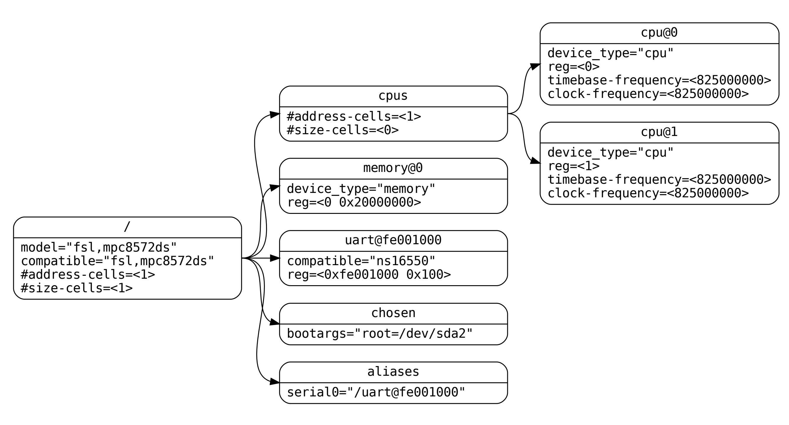
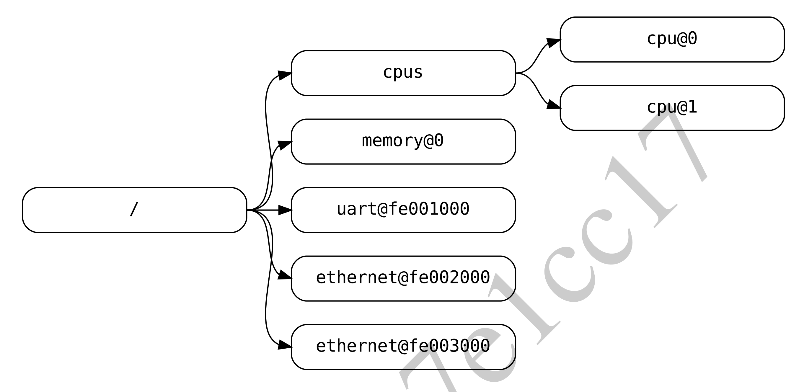

# 第二章 设备树

> CHAPTER TWO THE DEVICETREE

## 2.1 概述

> 2.1 Overview

DTSpec 指定了一个叫做设备树的结构来描述系统硬件。引导程序将设备树加载到客户程序的内存中，并将设备树的指针传递给客户程序。

> DTSpec specifies a construct called a devicetree to describe system hardware. A boot program loads a devicetree into a client program’s memory and passes a pointer to the devicetree to the client.

本章描述了设备树的逻辑结构，并指定了一套用于描述设备节点的基本属性。第三章规定了符合 DTSpec 的设备树所要求的某些设备节点。第四章描述了 DTSpec 定义的设备绑定--代表某些设备类型或设备类别的要求。第五章描述了设备树的内存编码。

> This chapter describes the logical structure of the devicetree and specifies a base set of properties for use in describing device nodes. Chapter 3 specifies certain device nodes required by a DTSpec-compliant devicetree. Chapter 4 describes the DTSpec-defined device bindings – the requirements for representing certain device types or classes of devices. Chapter 5 describes the in-memory encoding of the devicetree.

设备树是一种树形数据结构，其节点描述了系统中的设备。每个节点都有描述所代表设备特性的属性/值对。每个节点都有一个父节点，除了根节点，它没有父节点。

> A devicetree is a tree data structure with nodes that describe the devices in a system. Each node has property/value pairs that describe the characteristics of the device being represented. Each node has exactly one parent except for the root node, which has no parent.

符合 DTSpec 的设备树描述了系统中不一定能被客户程序动态地检测到的设备信息。例如，PCI 的结构使客户端能够探测并确认接入的设备，因此描述 PCI 设备的设备树节点可能不需要。然而，如果系统中的 PCI 主机桥设备不能被探测到，则需要一个设备节点来描述它。

> A DTSpec-compliant devicetree describes device information in a system that cannot necessarily be dynamically detected by a client program. For example, the architecture of PCI enables a client to probe and detect attached devices, and thus devicetree nodes describing PCI devices might not be required. However, a device node is required to describe a PCI host bridge device in the system if it cannot be detected by probing.

### 示例

> Example

图 2.1 显示了一个简单的设备树的例子，它几乎完整到足以启动一个简单的操作系统，描述了平台类型、CPU、内存和一个串口设备。设备节点显示了每个节点内的属性和值。

> Fig. 2.1 shows an example representation of a simple devicetree that is nearly complete enough to boot a simple operating system, with the platform type, CPU, memory and a single UART described. Device nodes are shown with properties and values inside each node.



## 2.2 设备树结构与约定

> 2.2 Devicetree Structure and Conventions

### 2.2.1 节点名

> 2.2.1 Node Names

#### 节点名要求

> Node Name Requirements

设备树中的每个节点都根据以下约定命名：

```text
节点名@单元地址
```

> Each node in the devicetree is named according to the following convention:
>
> ```text
> node-name@unit-address
> ```

**节点名**部分指定节点的名称。它的长度**应当**为 1 到 31 个字符，并且仅由表 2.1 中字符集中的字符组成。

> The *node-name* component specifies the name of the node. It shall be 1 to 31 characters in length and consist solely ofcharacters from the set of characters in Table 2.1.

表 2.1：合法的节点名字符

| 字符 | 描述
| :-: | -
| 0-9 | digit
| a-z | 小写字母
| A-Z | 大写字母
|  ,  | 逗号
|  .  | 句号
|  _  | 下划线
|  +  | 加号
|  -  | 连字符

**节点名**应以小写或大写字母开始，并应描述设备的一般类别。

> The *node-name* shall start with a lower or uppercase character and should describe the general class of device.

名称中的**单元地址**部分特定于节点所在的总线类型。它由表 2.1 的字符集中的一个或多个ASCII字符组成。**单元地址**必须与节点的 `reg` 属性中指定的第一个地址相匹配。如果节点没有 `reg` 属性，**@单元地址**必须被省略，仅节点名称就能将节点与树中同级别的其他节点区分开来。特定总线的绑定可能会对 `reg` 和**单元地址**的格式指定额外的、更具体的要求。

> The *unit-address* component of the name is specific to the bus type on which the node sits. It consists of one or more ASCII characters from the set of characters in Table 2.1. The *unit-address* must match the first address specified in the reg property of the node. If the node has no reg property, the *@unit-address* must be omitted and the node-name alone differentiates the node from other nodes at the same level in the tree. The binding for a particular bus may specify additional, more specific requirements for the format of reg and the *unit-address*.

不包含 **@单元地址**的**节点名**应当在树结构的同级的所有属性名中是唯一的。

> In the case of *node-name* without an *@unit-address* the *node-name* shall be unique from any property names at the same level in the tree.

根节点没有**节点名**或**单元地址**。它由一个正斜杠（/）标识。

> The root node does not have a *node-name* or *unit-address*. It is identified by a forward slash (/).



图 2.2 中：

> In Fig 2.2:

- 名称为 cpu 的节点通过其单位地址值 0 和 1 来区分。
- 名字为 ethernet 的节点通过它们的单位地址值 fe002000 和 fe003000 来区分。

> - The nodes with the name cpu are distinguished by their unit-address values of 0 and 1.
> - The nodes with the name ethernet are distinguished by their unit-address values of fe002000 and fe003000.

### 2.2.2 推荐通用名称

> 2.2.2 Generic Names Recommendation

节点的名称应该相对通用，反映设备的功能，而不是其精确的编程模型。如果合适的话，该名称应该是以下选择之一：

> The name of a node should be somewhat generic, reflecting the function of the device and not its precise programming model. If appropriate, the name should be one of the following choices:

- adc
- accelerometer
- air-pollution-sensor
- atm
- audio-codec
- audio-controller
- backlight
- bluetooth
- bus
- cache-controller
- camera
- can
- charger
- clock
- clock-controller
- co2-sensor
- compact-flash
- cpu
- cpus
- crypto
- disk
- display
- dma-controller
- dsi
- dsp
- eeprom
- efuse
- endpoint
- ethernet
- ethernet-phy
- fdc
- flash
- gnss
- gpio
- gpu
- gyrometer
- hdmi
- hwlock
- i2c
- i2c-mux
- ide
- interrupt-controlle
- iommu
- isa
- keyboard
- key
- keys
- lcd-controller
- led
- leds
- led-controller
- light-sensor
- lora
- magnetometer
- mailbox
- mdio
- memory
- memory-controller
- mmc
- mmc-slot
- mouse
- nand-controller
- nvram
- oscillator
- parallel
- pc-card
- pci
- pcie
- phy
- pinctrl
- pmic
- pmu
- port
- ports
- power-monitor
- pwm
- regulator
- reset-controller
- rng
- rtc
- sata
- scsi
- serial
- sound
- spi
- sram-controller
- ssi-controller
- syscon
- temperature-sensor
- timer
- touchscreen
- tpm
- usb
- usb-hub
- usb-phy
- video-codec
- vme
- watchdog
- wifi

### 2.2.3 路径名

设备树中的一个节点可以通过指定从根节点经过所有中间节点再到所需节点的完整路径来唯一地识别。

> A node in the devicetree can be uniquely identified by specifying the full path from the root node, through all descendant nodes, to the desired node.

指定一个设备路径的约定是：

```text
/节点名-1/节点名-2/节点名-N
```

> The convention for specifying a device path is:
>
> ```text
> /node-name-1/node-name-2/node-name-N
> ```

例如，图 2.2 中 #1 号 cpu 的设备路径是：

```text
/cpus/cpu@1
```

> For example, in Fig. 2.2, the device path to cpu #1 would be:
>
> ```text
> /cpus/cpu@1
> ```

根节点的路径是 /。

> The path to the root node is /.

如果节点的完整路径是明确的，可以省略单元地址。

> A unit address may be omitted if the full path to the node is unambiguous.

遇到不明确的路径对客户程序是未定义行为。

> If a client program encounters an ambiguous path, its behavior is undefined.

### 2.2.4 属性

> 2.2.4 Properties

设备树中的每个节点都有描述该节点特性的属性。属性由一个名称和一个值组成。

> Each node in the devicetree has properties that describe the characteristics of the node. Properties consist of a name and a value.

#### 属性名

> Property Names

属性名是由表 2.2 中显示的字符组成的 1 至 31 个字符的字符串。

> Property names are strings of 1 to 31 characters from the characters show in Table 2.2.

表 2.2：合法的属性名字符

| 字符 | 描述
| :-: | -
| 0-9 | digit
| a-z | 小写字母
| A-Z | 大写字母
|  ,  | 逗号
|  .  | 句号
|  _  | 下划线
|  +  | 加号
|  ?  | 问号
|  #  | 井号
|  -  | 连字符

非标准属性名称应指定一个独特的字符串前缀，如股票代码，识别定义该属性的公司或组织的名称。例如：

> Nonstandard property names should specify a unique string prefix, such as a stock ticker symbol, identifying the name of the company or organization that defined the property. Examples:

```text
fsl,channel-fifo-len
ibm,ppc-interrupt-server#s
linux,network-index
```

#### 属性值

> Property Values

一个属性值是一个由零个或多个字节组成的数组，包含与属性相关的信息。

> A property value is an array of zero or more bytes that contain information associated with the property.

如果传达的是二值信息，属性可能会有一个空值。在这种情况下，属性的存在或不存在就具有足够的描述性。

> Properties might have an empty value if conveying true-false information. In this case, the presence or absence of the property is sufficiently descriptive.

表 2.3 描述 DTSpec 定义的基本值类型集合

> Table 2.3 describes the set of basic value types defined by the DTSpec.

- `<empty>`

  值为空。用于传达二值信息，属性本身的存在或不存在就足以说明问题。

  > Value is empty. Used for conveying true-false information, when the presence or absence of the property itself is sufficiently descriptive.

- `<u32>`

  大端格式的 32 位整数。例如：32 位值 0x11223344 在内存中会被表示为：

  > A 32-bit integer in big-endian format. Example: the 32-bit value 0x11223344 would be represented in memory as:

  ```text
  address   11
  address+1 22
  address+2 33
  address+3 44
  ```

- `<u64>`

  代表一个大端格式的 64 位整数。由两个 `<u32>` 值组成，第一个值包含整数的高 32 位，第二个值包含低 32 位。

  > Represents a 64-bit integer in big-endian format. Consists of two `<u32>` values where the first value contains the most significant bits of the integer and the second value contains the least significant bits.

  例如：64 位值 0x1122334455667788 会被表示为 2 个单元，即 `<0x11223344 0x55667788>`。

  > Example: the 64-bit value 0x1122334455667788 would be represented as two cells as: `<0x11223344 0x55667788>`.

  值将在内存中表示为：

  > The value would be represented in memory as:

  ```text
  address   11
  address+1 22
  address+2 33
  address+3 44
  ```

- `<string>`

  字符串是可打印的，且以空结尾。例如：字符串 `"hello"` 在内存中表示为：

  > Strings are printable and null-terminated. Example: the string “hello” would be represented in memory as:

  ```text
    address 68 'h'
  address+1 65 'e'
  address+2 6C 'l'
  address+3 6C 'l'
  address+4 6F 'o'
  address+5 00 '\0'
  ```

- `<prop-encoded-array>`

  格式特定于属性。参见属性定义。

  > Format is specific to the property. See the property definition.

- `<phandle>`

  一个 `<u32>` 值。`phandle` 值是引用设备树中另一个节点的一种方式。任何可以被引用的节点都定义了一个具有唯一的 `<u32>` 值的 `phandle` 属性。这个数字被用于具有 `phandle` 值类型的属性的值。

  > A `<u32>` Value. A phandle value is a way to reference another node in the devicetree. Any node that can be referenced defines a phandle property with a unique `<u32>` value. That number is used for the value of properties with a phandle value type.

- `<stringlist>`

  串联在一起的 `<string>` 值列表。

  > A list of `<string>` values concatenated together.

  例如：字符串列表 `"hello", "world"` 在内存中表示为：

  > Example: The string list “hello”, “world” would be represented in memory as:

  ```text
     address 68 'h'
   address+1 65 'e'
   address+2 6C 'l'
   address+3 6C 'l'
   address+4 6F 'o'
   address+5 00 '\0'
   address+6 77 'w'
   address+7 6f 'o'
   address+8 72 'r'
   address+9 6C 'l'
  address+10 64 'd'
  address+11 00 '\0'
  ```

## 2.3 标准属性

> 2.3 Standard Properties

DTSpec 为设备节点指定了一组标准属性。这些属性将在本节中详细描述。由 DTSpec 定义的设备节点（见第三章）可以指定关于使用标准属性的额外要求或约束。第四章描述了特定设备的表示方法，也可能指定额外的要求。

> DTSpec specifies a set of standard properties for device nodes. These properties are described in detail in this section. Device nodes defined by DTSpec (see Chapter 3) may specify additional requirements or constraints regarding the use of the standard properties. Chapter 4 describes the representation of specific devices and may also specify additional requirements.

---

**注意**：本文件中所有的设备树节点的例子都使用 DTS（设备树源码）格式来指定节点和属性。

> **Note**: All examples of devicetree nodes in this document use the DTS (Devicetree Source) format for specifying nodes and properties.

---

### 2.3.1 `compatible`

属性名：`compatible`

值类型：`<stringlist>`

描述：

**兼容性**属性值由一个或多个字符串组成，这些字符串定义了电子设备的特定编程模型。这个字符串列表应该被客户程序用来选择设备驱动程序。属性值由一个空结尾字符串的串联列表组成，从最具体到最一般。它们允许设备表达其与一系列类似设备的兼容性，有可能允许一个设备驱动程序与多个设备相匹配。

> The *compatible* property value consists of one or more strings that define the specific programming model for e device. This list of strings should be used by a client program for device driver selection. The property lue consists of a concatenated list of null terminated strings, from most specific to most general. They allow device to express its compatibility with a family of similar devices, potentially allowing a single device driver  match against several devices.

推荐的格式是“制造商，型号”，其中制造商是一个描述制造商名称的字符串（如股票代码），而型号则指定型号。

> The recommended format is "manufacturer,model", where manufacturer is a string describing the name of the manufacturer (such as a stock ticker symbol), and model specifies the model number.

兼容的字符串应仅由小写字母、数字和破折号组成，并应以字母开头。通常只在供应商前缀之后使用单个逗号。不应使用下划线。

> The compatible string should consist only of lowercase letters, digits and dashes, and should start with a letter. A single comma is typically only used following a vendor prefix. Underscores should not be used.

示例：

```dts
compatible = "fsl,mpc8641", "ns16550";
```

在这个例子中，操作系统首先会尝试找到一个支持 `fsl,mpc8641` 的设备驱动程序。如果没有找到驱动程序，它就会试图找到一个支持更普遍的 `ns16550` 设备类型的驱动程序。

> In this example, an operating system would first try to locate a device driver that supported fsl,mpc8641. If a driver was not found, it would then try to locate a driver that supported the more general ns16550 device type.
