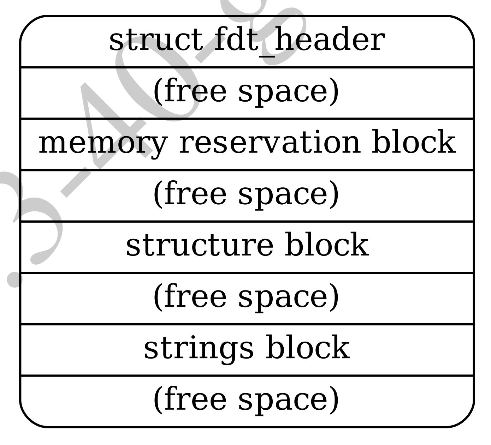

# 第五章 扁平设备树（DTB）格式

> CHAPTER FIVE FLATTENED DEVICETREE (DTB) FORMAT

设备树二进制对象（DTB）格式是一种扁平的二进制编码的设备树数据。它用于在软件程序之间交换设备树数据。例如，在启动操作系统时，固件会将 DTB 传递给操作系统内核。

> The Devicetree Blob (DTB) format is a flat binary encoding of devicetree data. It used to exchange devicetree data between software programs. For example, when booting an operating system, firmware will pass a DTB to the OS kernel.

---

**注意**：IEEE1275 开放固件没有定义 DTB 格式。在大多数开放固件兼容的平台上，设备树是通过调用固件方法遍历树结构提取的。

> **Note**: IEEE1275 Open Firmware [IEEE1275] does not define the DTB format. On most Open Firmware compliant platforms the devicetree is extracted by calling firmware methods to walk through the tree structure.

---

DTB 格式在一个单一的、线性的、无指针的数据结构中对设备树数据进行编码。它包括一个小首部（见第 5.2 节），然后是三个大小不一的部分：保留内存块（见第 5.3 节）、结构块（见第 5.4 节）和字符串块（见第 5.5 节）。这些都应该按照这个顺序出现在扁平化的设备树中。因此，设备树结构作为一个整体，当按地址加载到内存中时，将类似于图 5.1 中的样子（低地址在图的顶部）。

> The DTB format encodes the devicetree data within a single, linear, pointerless data structure. It consists of a small header (see Section 5.2), followed by three variable sized sections: the memory reservation block (see Section 5.3), the structure block (see Section 5.4), and the strings block (see Section 5.5). These should be present in the flattened devicetree in that order. Thus, the devicetree structure as a whole, when loaded into memory at address, will resemble the diagram in Fig. 5.1 (lower addresses are at the top of the diagram).



（空闲空间）部分可以不存在，但在某些情况下可能需要它们来满足各个块的对齐限制（见第5.6节）。

> The (free space) sections may not be present, though in some cases they might be required to satisfy the alignment constraints of the individual blocks (see Section 5.6).

## 5.1 版本管理

> 5.1 Versioning

自从此格式的首次定义，已经定义了几个版本的扁平设备树结构。首部中的字段给出版本，以便客户程序可以确定设备树是否以兼容格式编码。

> Several versions of the flattened devicetree structure have been defined since the original definition of the format. Fields in the header give the version, so that the client program can determine if the devicetree is encoded in a compatible format.

本文档只描述了格式的第 17 个版本。兼容 DTSpec 的引导程序应当提供 17 版或更高版本的设备树，也可以提供向后兼容 16 版的设备树。兼容 DTSpec 的客户程序应当接受任何向后兼容 17 版的设备树，也可以接受其他版本。

This document describes only version 17 of the format. DTSpec compliant boot programs shall provide a devicetree of version 17 or later, and should provide a devicetree of a version that is backwards compatible with version 16. DTSpec compliant client programs shall accept devicetrees of any version backwards compatible with version 17 and may accept other versions as well.

---

**注意**：版本是关于设备树的二进制结构的，而不是它的内容。

> **Note**: The version is with respect to the binary structure of the device tree, not its content.

---

### 5.2 首部

> 5.2 Header

设备树的首部布局由以下 C 结构定义。所有首部字段都是 32 位整数，以大端格式存储。

> The layout of the header for the devicetree is defined by the following C structure. All the header fields are 32-bit integers, stored in big-endian format.

#### 扁平化的设备树首部字段

> Flattened Devicetree Header Fields

```c
struct fdt_header {
    uint32_t magic;
    uint32_t totalsize;
    uint32_t off_dt_struct;
    uint32_t off_dt_strings;
    uint32_t off_mem_rsvmap;
    uint32_t version;
    uint32_t last_comp_version;
    uint32_t boot_cpuid_phys;
    uint32_t size_dt_strings;
    uint32_t size_dt_struct;
};
```

**`magic`** 该字段应当包含值 0xd00dfeed（大端）。

> **`magic`** This field shall contain the value 0xd00dfeed (big-endian).

**`totalsize`** 该字段应包含设备树数据结构的总大小（以字节为单位）。此大小应包含结构的所有部分：首部、保留内存块、结构块和字符串块，以及块之间或最终块之后的任何空闲空间间隙。

> **`totalsize`** This field shall contain the total size in bytes of the devicetree data structure. This size shall encompass all sections of the structure: the header, the memory reservation block, structure block and strings block, as well as any free space gaps between the blocks or after the final block.

**`off_dt_struct`** 该字段应包含结构块（参见第 5.4 节）从头开始的字节偏移量。

> **`off_dt_struct`** This field shall contain the offset in bytes of the structure block (see Section 5.4) from the beginning of the header.

**`off_dt_strings`** 该字段应包含字符串块（参见第 5.5 节）从头开始的偏移量。

> **`off_dt_strings`** This field shall contain the offset in bytes of the strings block (see Section 5.5) from the beginning of the header.

**`off_mem_rsvmap`** 该字段应包含保留内存块（参见第 5.3 节）从头开始的偏移量。

> **`off_mem_rsvmap`** This field shall contain the offset in bytes of the memory reservation block (see Section 5.3) from the beginning of the header.

**`version`** 此字段应包含设备树数据结构的版本。如果使用本文档中定义的结构，则版本为 17。（符合）DTSpec 的引导程序可能会提供更高版本的设备树，在这种情况下，该字段应包含在任何提供该版本详细信息的后续文档中定义的版本号。

> **`version`** This field shall contain the version of the devicetree data structure. The version is 17 if using the structure as defined in this document. An DTSpec boot program may provide the devicetree of a later version, in which case this field shall contain the version number defined in whichever later document gives the details of that version.

**`last_comp_version`** 该字段应包含所用版本向后兼容的设备树数据结构的最低版本。因此，对于本文档中定义的结构（版本 17），该字段应包含 16，因为版本 17 向后兼容版本 16，但不兼容早期版本。根据第 5.1 节，DTSpec 引导程序应提供与版本 16 向后兼容的格式的设备树，因此该字段应始终包含 16。

> **`last_comp_version`** This field shall contain the lowest version of the devicetree data structure with which the version used is backwards compatible. So, for the structure as defined in this document (version 17), this field shall contain 16 because version 17 is backwards compatible with version 16, but not earlier versions. As per Section 5.1, a DTSpec boot program should provide a devicetree in a format which is backwards compatible with version 16, and thus this field shall always contain 16.

**`boot_cpuid_phys`** 此字段应包含系统启动 CPU 的物理 ID。它应与设备树中该 CPU 节点的 `reg` 属性中给出的物理 ID 相同。

> **`boot_cpuid_phys`** This field shall contain the physical ID of the system’s boot CPU. It shall be identical to the physical ID given in the reg property of that CPU node within the devicetree.

**`size_dt_strings`** 该字段应包含设备树二进制对象的字符串块部分的字节长度。

> **`size_dt_strings`** This field shall contain the length in bytes of the strings block section of the devicetree blob.

**`size_dt_struct`** 该字段应包含设备树二进制对象的结构块部分的字节长度。

> **`size_dt_struct`** This field shall contain the length in bytes of the structure block section of the devicetree blob.

## 5.4 结构块

> 5.4 Structure Block

结构块描述了设备树本身的结构和内容。它由一系列带有数据的标记组成，如下所述。这些标记被组织成线性树结构，如下所述。

> The structure block describes the structure and contents of the devicetree itself. It is composed of a sequence of tokens with data, as described below. These are organized into a linear tree structure, as described below.

结构块中的每个标记，以及结构块本身，都应位于距设备树二进制对象开头的 4 字节对齐偏移处（参见第 5.6 节）。

> Each token in the structure block, and thus the structure block itself, shall be located at a 4-byte aligned offset from the beginning of the devicetree blob (see Section 5.6).

### 5.4.1 词法结构

> 5.4.1 Lexical structure

结构块由一系列片段组成，每个片段都以一个标记开头，即一个大端格式的 32 位整数。

> The structure block is composed of a sequence of pieces, each beginning with a token, that is, a big-endian 32-bit integer.

一些标记后面是额外的数据，其格式由标记值确定。所有标记都应在 32 位边界上对齐，这可能需要在前一个标记的数据之后插入填充字节（值为 0x0）。

Some tokens are followed by extra data, the format of which is determined by the token value. All tokens shall be aligned on a 32-bit boundary, which may require padding bytes (with a value of 0x0) to be inserted after the previous token’s data.

五种标记类型如下：

> The five token types are as follows:

**FDT_BEGIN_NODE (0x00000001)** FDT_BEGIN_NODE 标记标志着节点表示的开始。后跟节点的单元名称作为额外数据。名称存储为以空字符结尾的字符串，并且应包括单元地址（参见第 2.2.1 节），如果有的话。节点名称后跟零填充字节（如果需要对齐），然后是下一个标记，可以是除 FDT_END 之外的任何标记。

> **FDT_BEGIN_NODE (0x00000001)** The FDT_BEGIN_NODE token marks the beginning of a node’s representation. It shall be followed by the node’s unit name as extra data. The name is stored as a null-terminated string, and shall include the unit address (see Section 2.2.1), if any. The node name is followed by zeroed padding bytes, if necessary for alignment, and then the next token, which may be any token except FDT_END.

**FDT_END_NODE (0x00000002)** FDT_END_NODE 标记标志着节点表示的结束。这个标记没有额外的数据；因此紧随其后的是下一个标记，可以是除 FDT_PROP 之外的任何标记。

> **FDT_END_NODE (0x00000002)** The FDT_END_NODE token marks the end of a node’s representation. This token has no extra data; so it is followed immediately by the next token, which may be any token except FDT_PROP.

**FDT_PROP (0x00000003)** FDT_PROP 标记标志着设备树中一个属性表示的开始。后面应有描述属性的额外数据。该数据首先包含属性的长度和名称，表示为以下 C 结构：

> **FDT_PROP (0x00000003)** The FDT_PROP token marks the beginning of the representation of one property in the devicetree. It shall be followed by extra data describing the property. This data consists first of the property’s length and name represented as the following C structure:

```c
struct {
    uint32_t len;
    uint32_t nameoff;
};
```

此结构中的两个字段都是 32 位大端整数。

Both the fields in this structure are 32-bit big-endian integers.

- `len` 以字节为单位给出属性值的长度（可能为零，表示一个空属性，参见第 2.2.4 节）。
- `nameoff` 为字符串块（见第 5.5 节）提供了一个偏移量，在该块中，属性的名称被存储为一个以空字符结尾的字符串。

> - len gives the length of the property’s value in bytes (which may be zero, indicating an empty property, see Section 2.2.4).
> - nameoff gives an offset into the strings block (see Section 5.5) at which the property’s name is stored as a null-terminated string.

在这个结构之后，属性的值以长度为 `len` 的字节串形式给出。该值后跟零填充字节（如有必要）以对齐下一个 32 位边界，然后是下一个标记，可以是除 FDT_END 之外的任何标记。

> After this structure, the property’s value is given as a byte string of length len. This value is followed by zeroed padding bytes (if necessary) to align to the next 32-bit boundary and then the next token, which may be any token except FDT_END.

**FDT_NOP (0x00000004)** 解析设备树的任何程序都将忽略 FDT_NOP 标记。这个标记没有额外的数据；因此紧随其后的是下一个标记，可以是任何有效的标记。树中的属性或节点定义可以用 FDT_NOP 标记覆盖，以将其从树中删除，而无需在设备树 blob 中移动树表示的其他部分。

> **FDT_NOP (0x00000004)** The FDT_NOP token will be ignored by any program parsing the device tree. This token has no extra data; so it is followed immediately by the next token, which can be any valid token. A property or node definition in the tree can be overwritten with FDT_NOP tokens to remove it from the tree without needing to move other sections of the tree’s representation in the devicetree blob.

**FDT_END (0x00000009)** FDT_END 标记标志着结构块的结束。只能有一个 FDT_END 标记，它应当是结构块中的最后一个标记。它没有额外的数据；因此，紧跟在 FDT_END 标记之后的字节与结构块开头的偏移量等于设备树二进制对象首部中 `size_dt_struct` 字段的值。

> **FDT_END (0x00000009)** The FDT_END token marks the end of the structure block. There shall be only one FDT_END token, and it shall be the last token in the structure block. It has no extra data; so the byte immediately after the FDT_END token has offset from the beginning of the structure block equal to the value of the size_dt_struct field in the device tree blob header.

### 5.4.2 树结构

> 5.4.2 Tree structure

设备树结构表示为线性树：每个节点的表示以 FDT_BEGIN_NODE 标记开始，以 FDT_END_NODE 标记结束。节点的属性和子节点（如果有）在 FDT_END_NODE 之前表示，因此这些子节点的 FDT_BEGIN_NODE 和 FDT_END_NODE 标记嵌套在父节点的标记中。

> The devicetree structure is represented as a linear tree: the representation of each node begins with an FDT_BEGIN_NODE token and ends with an FDT_END_NODE token. The node’s properties and subnodes (if any) are represented before the FDT_END_NODE, so that the FDT_BEGIN_NODE and FDT_END_NODE tokens for those subnodes are nested within those of the parent.

整个结构块由根节点的表示（包含所有其他节点的表示）组成，后跟一个 FDT_END 标记，以标记整个结构块的结束。

> The structure block as a whole consists of the root node’s representation (which contains the representations for all other nodes), followed by an FDT_END token to mark the end of the structure block as a whole.

更准确地说，每个节点的表示由以下组件组成：

> More precisely, each node’s representation consists of the following components:

- （可选）任意数量的 FDT_NOP 标记

- FDT_BEGIN_NODE 标记
  - 节点名称为空终止字符串
  - \[将填充零字节以对齐 4 字节边界\]

- 对于节点的每个属性：
  - （可选）任意数量的 FDT_NOP 标记
  - FDT_PROP 标记
    - 第 5.4.1 节中给出的属性信息
    - \[将填充零字节以对齐 4 字节边界\]

- 这种格式的所有子节点的表示
- （可选）任意数量的 FDT_NOP 标记
- FDT_END_NODE 标记

> - (optionally) any number of FDT_NOP tokens
>
> - FDT_BEGIN_NODE token
>   - The node’s name as a null-terminated string
>   - [zeroed padding bytes to align to a 4-byte boundary]
>
> - For each property of the node:
>   - (optionally) any number of FDT_NOP tokens
>   - FDT_PROP token
>     - property information as given in Section 5.4.1
>     - [zeroed padding bytes to align to a 4-byte boundary]
>
> - Representations of all child nodes in this format
> - (optionally) any number of FDT_NOP tokens
> - FDT_END_NODE token

请注意，此过程要求特定节点的所有属性定义都位于该节点的任何子节点定义之前。尽管如果属性和子节点混合在一起，结构不会有歧义，但如此要求将简化处理扁平树所需的代码。

Note that this process requires that all property definitions for a particular node precede any subnode definitions for that node. Although the structure would not be ambiguous if properties and subnodes were intermingled, the code needed to process a flat tree is simplified by this requirement.

## 5.5 字符串块

> 5.5 Strings Block

字符串块包含表示树中使用的所有属性名称的字符串。这些以空结尾的字符串在本节中简单地连接在一起，并从结构块中通过偏移量引用到字符串块中。

> The strings block contains strings representing all the property names used in the tree. These null terminated strings are simply concatenated together in this section, and referred to from the structure block by an offset into the strings block.

字符串块没有对齐约束，并且可以出现在距设备树二进制对象开头的任何偏移处。

> The strings block has no alignment constraints and may appear at any offset from the beginning of the devicetree blob.

## 5.6 对齐

> 5.6 Alignment

设备树二进制对象应位于 8 字节对齐的地址。为了保持 32 位机器的向后兼容性，某些软件支持 4 字节对齐，但这不符合 DTSpec。

> The devicetree blob shall be located at an 8-byte-aligned address. To maintain backwards compatibilty for 32-bit machines, 4-byte alignment is supported by some software, but this is not DTSpec-compliant.

对于要在没有未对齐内存访问的情况下使用的内存预留和结构块中的数据，它们应位于适当对齐的内存地址。具体来说，内存预留块应与 8 字节边界对齐，结构块应与 4 字节边界对齐。

> For the data in the memory reservation and structure blocks to be used without unaligned memory accesses, they shall lie at suitably aligned memory addresses. Specifically, the memory reservation block shall be aligned to an 8-byte boundary and the structure block to a 4-byte boundary.

此外，可以在不破坏子块对齐的情况下重新定位整个设备树二进制对象。

> Furthermore, the devicetree blob as a whole can be relocated without destroying the alignment of the subblocks.

如前几节所述，结构和字符串块应具有与设备树二进制对象开头的对齐偏移量。为了确保块的内存对齐，确保将设备树作为一个整体加载到与任何子块的最大对齐对齐的地址，即与 8 字节边界对齐就足够了。符合 DTSpec 的引导程序应在将设备树二进制对象传递给客户程序之前将其加载到这样一个对齐的地址。如果 DTSpec 客户程序将设备树二进制对象重新定位到内存中，它应该只对另一个 8 字节对齐的地址执行此操作。

> As described in the previous sections, the structure and strings blocks shall have aligned offsets from the beginning of the devicetree blob. To ensure the in-memory alignment of the blocks, it is sufficient to ensure that the devicetree as a whole is loaded at an address aligned to the largest alignment of any of the subblocks, that is, to an 8-byte boundary. A DTSpec compliant boot program shall load the devicetree blob at such an aligned address before passing it to the client program. If an DTSpec client program relocates the devicetree blob in memory, it should only do so to another 8-byte aligned address.
