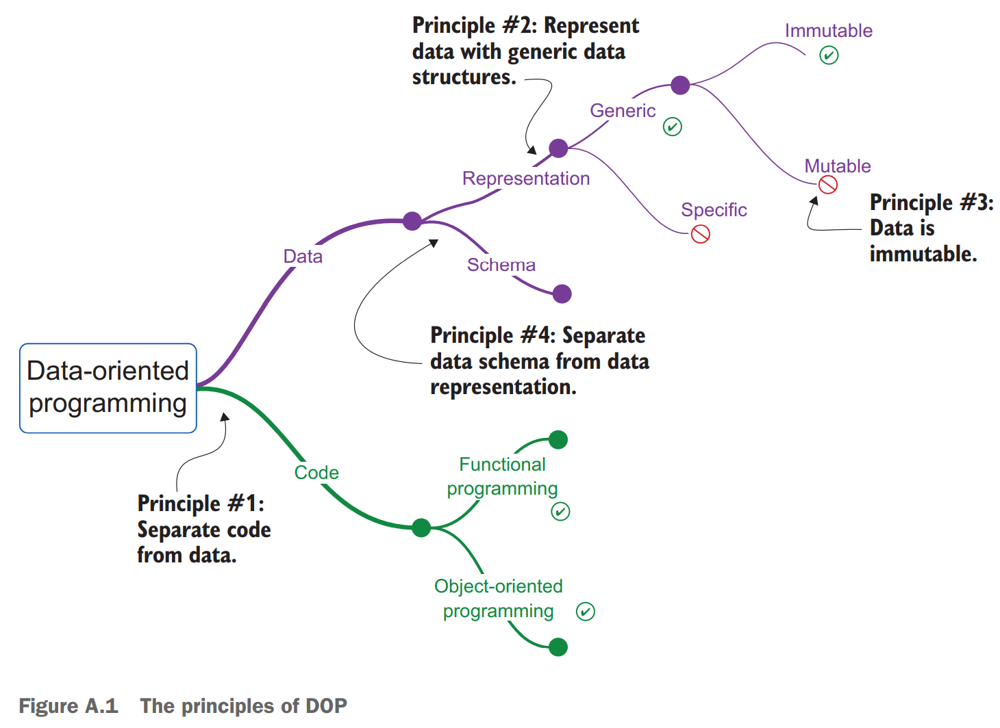

# 附录 A 面向数据编程的原理

> appendix A. Principles of data-oriented programming

面向数据的编程（DOP）是一个编程范式，旨在简化软件系统的设计和实现，例如，在前端或后端 Web 应用程序和 Web 服务等系统中将数据置于中心。DOP 并没有设计结合代码和数据的软件构造（例如，实例化的对象）的软件构造系统，而是鼓励代码与数据的分离。此外，DOP 提供了有关如何表示和操纵数据的准则。

> Data-oriented programming (DOP) is a programming paradigm aimed at simplifying the design and implementation of software systems, where information is at the center in systems such as frontend or backend web applications and web services, for example. Instead of designing information systems around software constructs that combine code and data (e.g., objects instantiated from classes), DOP encourages the separation of code from data. Moreover, DOP provides guidelines about how to represent and manipulate data.

---

**提示** 面向数据编程中，数据被视为“一等公民”。

> **TIP** In DOP, data is treated as a first-class citizen.

---

DOP 的本质是它将数据视为“一等公民”。它赋予开发者操纵程序中任何数据的能力，就如同操纵数字或字符串一样简单。基于以下四个核心原则，可以将数据视为“一等公民”：

> The essence of DOP is that it treats data as a first-class citizen. It gives developers the ability to manipulate data inside a program with the same simplicity as they manipulate numbers or strings. Treating data as a first-class citizen is made possible by adhering to four core principles:

- 代码（行为）与数据分离；
- 将数据表示为泛型数据结构；
- 数据视作不可变的；
- 数据模式与数据表示分离；

> - Separating code (behavior) from data.
> - Representing data with generic data structures.
> - Treating data as immutable.
> - Separating data schema from data representation.

一旦将这四个原则结合在一起，它们会形成一个凝聚的整体，如图 A.1 所示。使用 DOP 构建的系统更容易理解，因此将显著改善开发者的体验。

> When these four principles are combined, they form a cohesive whole as figure A.1 shows. Systems built using DOP are simpler and easier to understand, so the developer experience is significantly improved.

---

**提示** 在面向数据的系统中，代码与数据分分离。数据用不变并具有单独模式的泛型数据结构表示。

> **TIP** In a data-oriented system, code is separated from data. Data is represented with generic data structures that are immutable and have a separate schema.

> 【译者注】“a separate schema”究竟是什么东西？和这个有关吗 <https://planetmath.org/separatedscheme>？

---



注意，DOP 的原则是语言无关的。它们在以下的语言中均可实现（或破坏）：

> Notice that DOP principles are language-agnostic. They can be adhered to (or broken) in

- 面向对象编程（OOP）语言，比如 Java、C#、C++ 等；
- 函数式编程（FP）语言，比如 Clojure、OCaml、Haskell 等；
- 同时支持面向对象和函数式的语言，比如 JavaScript、Python、Ruby、Scala 等；

> - Object-oriented programming (OOP) languages such as Java, C#, C++, etc.
> - Functional programming (FP) languages such as Clojure, OCaml, Haskell, etc.
> - Languages that support both OOP and FP such as JavaScript, Python, Ruby, Scala, etc.

---

**提示** DOP 的原则是语言无关的。

> **TIP** DOP principles are language-agnostic.

---

**注意** 对于面向对象编程的开发者而言，向 DOP 的过渡可能需要更多的思维转移，函数式编程开发者则不用，因为 DOP 禁止在状态类中封装数据。

> **NOTE** For OOP developers, the transition to DOP might require more of a mind shift than for FP developers because DOP prohibits the encapsulation of data in stateful classes.

---

本附录简洁地说明了如何在 JavaScript 中实现或破坏这些原则。遵守每个原则的好处，以及享受这些好处的开销也会简要地提到。该附录还通过简单的代码段说明了 DOP 的原则。在整本书中，深入探讨了 DOP 原则在生产信息系统中的应用。

> This appendix succinctly illustrates how these principles can be applied or broken in JavaScript. Mentioned briefly are the benefits of adherence to each principle, and the costs paid to enjoy those benefits. This appendix also illustrates the principles of DOP via simple code snippets. Throughout the book, the application of DOP principles to production information systems is explored in depth.

## A.1 原则 #1：代码与数据分离

> A.1 Principle #1: Separate code from data

原则 #1 是一个设计原则，建议明确地分离代码（行为）和数据。这似乎是函数式编程的原则，但实际上可以在函数式或面向对象编程中均可实现或破坏它：

> Principle #1 is a design principle that recommends a clear separation between code (behavior) and data. This may appear to be a FP principle, but in fact, one can adhere to it or break it either in FP or in OOP:

- 在面向对象编程中实现该原则意味着将代码全部放在静态类的方法里；
- 在函数式编程中打破此原理意味着在函数的词法作用域内隐藏状态；

> - Adherence to this principle in OOP means aggregating the code as methods of a static class.
> - Breaking this principle in FP means hiding state in the lexical scope of a function.

> 【译者注】怎么能在纯函数里隐藏状态？*词法作用域*似乎只是 JS 特有的描述闭包的奇怪语言。捕获可变性形成一个可变的闭包根本不函数式。

同样，该原则与数据的表示方式无关。数据表示由原则 #2 解决。

> Also, this principle does not relate to the way data is represented. Data representation is addressed by Principle #2.

---

原则 #1 用这样的方式将代码与数据分离：将代码放在行为不取决于封装于上下文的数据的函数中。

> PRINCIPLE #1 Separate code from data in a way that the code resides in functions whose behavior does not depend on data that is encapsulated in the function’s context.

---

### A.1.1 原则 #1 的例证

> A.1.1 Illustration of Principle #1

我们对原则 #1 的探索始于说明如何将其应用于面向对象编程和函数式编程。以下各节说明了如何在一个简单的程序中实现或破坏该原则：

> Our exploration of Principle #1 begins by illustrating how it can be applied to OOP and FP. The following sections illustrate how this principle can be adhered to or broken in a simple program that deals with:

- 一个包含作者姓氏、名字和他们著作数量的作者实体；
- 计算作者全名的一些代码；
- 根据他们著作数量判断作者是否高产的一些代码；

> - An author entity with a firstName, a lastName, and the number of books they wrote.
> - A piece of code that calculates the full name of the author.
> - A piece of code that determines if an author is prolific, based on the number of books they wrote.

#### 在面向对象编程中破坏原则 #1

> BREAKING PRINCIPLE #1 IN OOP

当我们将数据和代码组合到对象中时，就会打破原则 #1。以下片段说明了这是什么样子。

> Breaking Principle #1 in OOP happens when we write code that combines data and code together in an object. The following listing demonstrates what this looks like.

```javascript
class Author {
    constructor(firstName, lastName, books) {
        this.firstName = firstName;
        this.lastName = lastName;
        this.books = books;
    }
    fullName() {
        return this.firstName + " " + this.lastName;
    }
    isProlific() {
        return this.books > 100;
    }
}
var obj = new Author("Isaac", "Asimov", 500); // ← 艾萨克·阿西莫夫真的写了差不多 500 本书！
obj.fullName();
// → "Isaac Asimov"
```

#### 在函数式编程中破坏原则 #1

> BREAKING PRINCIPLE #1 IN FP

在没有类的函数式编程中，打破此原则意味着将数据隐藏在函数的词法作用域中。以下片段提供了一个示例。

> Breaking this principle without classes in FP means hiding data in the lexical scope of a function. The next listing provides an example of this.

> 【译者注】如果捕获不可变变量的闭包也不允许那有点过分了。这和硬编码一个值在函数里有区别吗？不如说其实禁止动态生成函数算了。要我说问题在于调用这个函数生成另外的函数本身是数据相关的。

```javascript
function createAuthorObject(firstName, lastName, books) {
    return {
        fullName: function() {
            return firstName + " " + lastName;
        },
        isProlific: function () {
            return books > 100;
        }
    };
}
var obj = createAuthorObject("Isaac", "Asimov", 500);
obj.fullName();
// → "Isaac Asimov"
```

#### 在面向对象编程中实现原则 #1

> ADHERING TO PRINCIPLE #1 IN OOP

片段 A.3 显示了一个遵守原则 #1 的面向对象编程示例。即使是编写类，也可以遵守下列条件以实现这一原则：

> Listing A.3 shows an example that adheres to Principle #1 in OOP. Compliance with this principle may be achieved even with classes by writing programs such that:

- 代码由静态方法组成；
- 数据封装在数据类中（仅仅是数据容器的类）；

> - The code consists of static methods.
> - The data is encapsulated in data classes (classes that are merely containers of data).

```javascript
class AuthorData {
    constructor(firstName, lastName, books) {
        this.firstName = firstName;
        this.lastName = lastName;
        this.books = books;
    }
}
class NameCalculation {
    static fullName(data) {
        return data.firstName + " " + data.lastName;
    }
}
class AuthorRating {
    static isProlific(data) {
        return data.books > 100;
    }
}
var data = new AuthorData("Isaac", "Asimov", 500);
NameCalculation.fullName(data);
// → "Isaac Asimov"
```

#### 在函数式编程中实现原则 #1

> ADHERING TO PRINCIPLE #1 IN FP

片段 A.3 显示了一个遵守原则 #1 的函数式编程示例。实现此原则意味着将代码与数据分开。

> Listing A.4 shows an example that adheres to Principle #1 in FP. Compliance with this principle means separating code from data.

```javascript
function createAuthorData(firstName, lastName, books) {
    return {
        firstName: firstName,
        lastName: lastName,
        books: books
    };
}
function fullName(data) {
    return data.firstName + " " + data.lastName;
}
function isProlific (data) {
    return data.books > 100;
}
var data = createAuthorData("Isaac", "Asimov", 500);
fullName(data);
// → "Isaac Asimov"
```

### A.1.2 原则 #1 的益处

> A.1.2 Benefits of Principle #1

在说明了如何在面向对象和函数式编程中实现或破坏原则 #1 后，让我们看一下原则 #1 为我们的计划带来的好处。仔细将代码与数据分开以以下方式使我们的程序受益：

> Having illustrated how to follow or break Principle #1 both in OOP and FP, let’s look at the benefits that Principle #1 brings to our programs. Careful separation of code from data benefits our programs in the following ways:

- 代码可以在不同上下文中复用；
- 代码可以隔离测试；
- 系统往往不那么复杂；

> - Code can be reused in different contexts.
> - Code can be tested in isolation.
> - Systems tend to be less complex.

#### 益处 #1：代码可以在不同上下文中复用

> BENEFIT #1: CODE CAN BE REUSED IN DIFFERENT CONTEXTS

想象一下，除了作者实体外，还有一个用户实体与作者无关，但具有与作者实体相同的两个数据字段：`firstName` 和 `lastname`。对于作者和用户来说，计算全名的逻辑是相同的——检索具有相同名称的两个字段的值。但是，在传统的面向对象编程中，就像在列表 A.5 中具有 `CreateAuthorObject` 的版本中一样，`fullName` 代码不能以直接的方式在用户上重复使用，因为它已锁定在作者类中。

> Imagine that besides the author entity, there is a user entity that has nothing to do with authors but has two of the same data fields as the author entity: firstName and lastName. The logic of calculating the full name is the same for authors and users— retrieving the values of two fields with the same names. However, in traditional OOP as in the version with createAuthorObject in listing A.5, the code of fullName cannot be reused on a user in a straightforward way because it is locked inside the Author class.

```javascript
class Author {
    constructor(firstName, lastName, books) {
        this.firstName = firstName;
        this.lastName = lastName;
        this.books = books;
    }
    fullName() {
        return this.firstName + " " + this.lastName;
    }
    isProlific() {
        return this.books > 100;
    }
}
```
