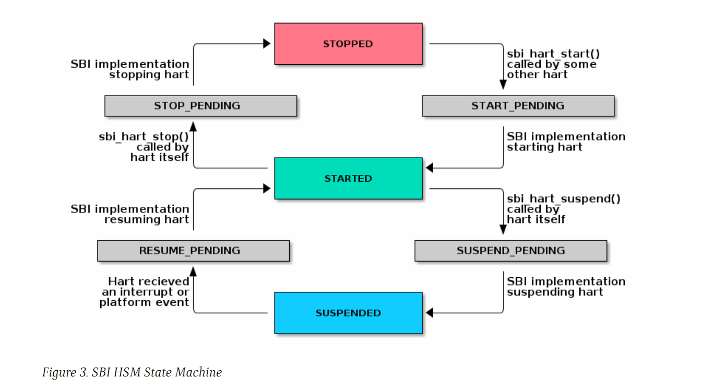

# 第九章 硬件线程状态管理扩展（扩展号 #0x48534D “HSM”）

> Chapter 9. Hart State Management Extension (EID #0x48534D "HSM")

硬件线程状态管理（HSM = Hart State Management）扩展引入了一组硬件线程状态和一组功能，这些功能允许特权态软件请求硬件线程状态更改。

> The Hart State Management (HSM) Extension introduces a set of hart states and a set of functions which allow the supervisor-mode software to request a hart state change.

下表 17 描述了所有可能的 HSM 状态及每个状态的唯一 HSM 状态号：

> The Table 17 shown below describes all possible HSM states along with a unique HSM state id for each state:

| 状态号 | 状态名称 | 描述 | 译文
| - | --------------- | - | -
| 0 | STARTED         | The hart is physically powered-up and executing normally. | 硬件线程已加电并正常运行。
| 1 | STOPPED         | The hart is not executing in supervisor-mode or any lower privilege mode. It is probably powered-down by the SBI implementation if the underlying platform has a mechanism to physically power-down harts. | 硬件线程在特权态或更低权限未处在运行状态。如果底层平台具有物理关闭硬件线程的机制，它可能会被 SBI 实现关闭。
| 2 | START_PENDING   | Some other hart has requested to start (or power-up) the hart from the **STOPPED** state and the SBI implementation is still working to get the hart in the **STARTED** state. | 其他一些硬件线程已请求从 **STOPPED** 状态启动（或上电）硬件线程，并且 SBI 仍在努力使硬件线程达到 **STARTED** 状态。
| 3 | STOP_PENDING    | The hart has requested to stop (or power-down) itself from the **STARTED** state and the SBI implementation is still working to get the hart in the **STOPPED** state. | 硬件线程已请求将其自身从 **STARTED** 状态停止（或断电），并且 SBI 仍在努力使硬件线程达到 **STOPPED** 状态。
| 4 | SUSPENDED       | This hart is in a platform specific suspend (or low power) state. | 硬件线程处在平台特异的挂起（或低功耗）状态。
| 5 | SUSPEND_PENDING | The hart has requested to put itself in a platform specific low power state from the **STARTED** state and the SBI implementation is still working to get the hart in the platform specific **SUSPENDED** state. | 硬件线程已请求将自己从 **STARTED** 状态置于平台特异的低功耗状态，并且 SBI 实现仍在努力使硬件线程达到平台特异的 **SUSPENDED** 状态。
| 6 | RESUME_PENDING  | An interrupt or platform specific hardware event has caused the hart to resume normal execution from the **SUSPENDED** state and the SBI implementation is still working to get the hart in the **STARTED** state. | 中断或平台特异的硬件事件导致硬件线程从 **SUSPENDED** 状态恢复正常执行，并且 SBI 实现仍在努力使硬件线程达到 **STARTED** 状态。

在任何时间点，硬件线程都应该处于上述硬件线程状态之一。SBI 实现的硬件线程状态转换应遵循图 3 所示的状态机。

> At any point in time, a hart should be in one of the above mentioned hart states. The hart state transitions by the SBI implementation should follow the state machine shown below in the Figure 3.

一个平台可以将多个硬件线程分组为分层拓扑组（即核心、集群、节点等），每个分层组具有单独的平台特异低功耗状态。分层拓扑组的这些平台特异的低功耗状态可以表示为硬件线程的平台特异性挂起状态。SBI 实现可以使用以下方法之一利用更高层拓扑组的挂起状态：

> A platform can have multiple harts grouped into hierarchical topology groups (namely cores, clusters, nodes, etc) with separate platform specific low-power states for each hierarchical group. These platform specific low-power states of hierarchical topology groups can be represented as platform specific suspend states of a hart. An SBI implementation can utilize the suspend states of higher topology groups using one of the following approaches:

1. 平台协作：在这种方法中，当硬件线程空闲时，特权态电源管理软件将请求此硬件线程和更高拓扑组的最深挂起状态。

   SBI 实现可以在更高拓扑组选择一种满足下列要求的挂起状态：

   1. 不深于特定的挂起状态
   2. 唤醒延迟不大于特定的挂起状态

2. 操作系统发起：在这种方法中，特权态电源管理软件将在该组中的最后一个硬件线程空闲后直接请求更高拓扑组挂起。当硬件线程空闲时，特权态电源管理软件将始终为硬件线程本身选择挂起状态，但只有当硬件线程是组中最后一个运行的硬件线程时，它才会为更高的拓扑组选择挂起状态。SBI 实现应该：

   1. 绝不为高拓扑组选择不同于特定挂起状态的挂起状态
   2. 总是倾向于为更高拓扑组选择最近请求过的挂起状态

> 1. Platform-coordinated: In this approach, when a hart becomes idle the supervisor-mode power-managment software will request deepest suspend state for the hart and higher topology groups.
>
>    An SBI implementation should choose a suspend state at higher topology group which is:
>
>    1. Not deeper than the specified suspend state
>    2. Wake-up latency is not higher than the wake-up latency of the specified suspend state
>
> 2. OS-inititated: In this approach, the supervisor-mode power-managment software will directly request a suspend state for higher topology group after the last hart in that group becomes idle. When a hart becomes idle, the supervisor-mode power-managment software will always select suspend state for the hart itself but it will select a suspend state for a higher topology group only if the hart is the last running hart in the group. An SBI implementation should:
>
>    1. Never choose a suspend state for higher topology group different from the specified suspend state
>    2. Always prefer most recent suspend state requested for higher topology group
