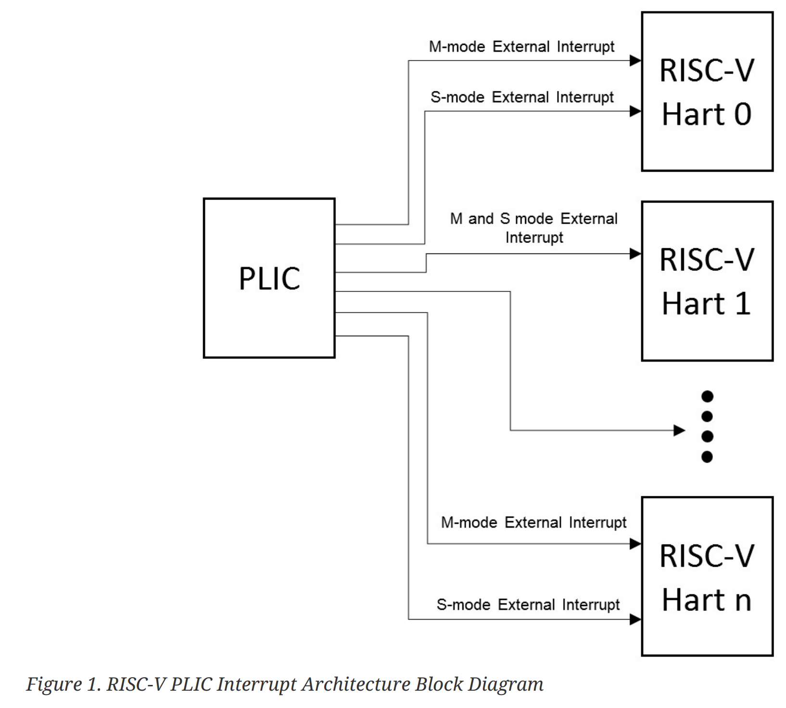

# RISC-V 平台级中断控制器规范

> RISC-V Platform-Level Interrupt Controller Specification

> [原文](https://github.com/riscv/riscv-plic-spec/releases/tag/1.0.0_rc5)

## 第一章 引言

> Chapter 1. Introduction

本规范根据 RISC-V 平台级中断控制器（PLIC）规范（已从 RISC-V Privileged Spec v1.11-draft 中删除）中定义的通用 PLIC 架构划定了运行参数，以便在 RISC-V 系统的上下文中工作。

> This specification delineates the operation parameters according the general PLIC architecture defined in the RISC-V platform-level interrupt controller (PLIC) specification (was removed from RISC-V Privileged Spec v1.11-draft) to work in the context of RISC-V systems.

PLIC 将各种设备中断复用到硬件线程上下文的外部中断线上，并对中断优先级提供硬件支持。PLIC 最多支持 1023 个中断（0 为保留）和 15872 个上下文，但中断和上下文的实际数量取决于 PLIC 的实现。然而，该实现必须遵守 PLIC 运行参数中每个寄存器的偏移量。声称符合 PLIC 标准的 PLIC 应该遵循以下章节中提到的实现方式。

> The PLIC multiplexes various device interrupts onto the external interrupt lines of Hart contexts, with hardware support for interrupt priorities. PLIC supports up-to 1023 interrupts (0 is reserved) and 15872 contexts, but the actual number of interrupts and context depends on the PLIC implementation. However, the implement must adhere to the offset of each register within the PLIC operation parameters. The PLIC which claimed as PLIC-Compliant standard PLIC should follow the implementations mentioned in sections below.

### 1.1. 中断目标和硬件线程上下文

> 1.1. Interrupt Targets and Hart Contexts

中断目标通常是硬件线程上下文。这里的硬件线程上下文指的是某个硬件线程上的某个权限级别（尽管还有其他可能的中断目标，如 DMA 引擎）。例如，在一个具有 2 路对称多线程的 4 核系统中有 8 个硬件线程，每个硬件线程可能至少有两种权限级别：机器态和特权态（[参考](https://github.com/torvalds/linux/blob/5bfc75d92efd494db37f5c4c173d3639d4772966/Documentation/devicetree/bindings/interrupt-controller/sifive%2Cplic-1.0.0.yaml)）。

> Interrupt targets are usually hart contexts, where a hart context is a given privilege mode on a given hart (though there are other possible interrupt targets, such as DMA engines). For example, in an 4-core system with 2-way SMT, you have 8 harts and probably at least two privilege modes per hart: machine mode and supervisor mode (Ref).

不是所有的硬件线程上下文都需要成为中断目标，特别是，如果一个处理器核芯不支持将外部中断委托给较低权限级别，那么较低权限的硬件线程上下文就不会成为中断目标。由 PLIC 产生的中断通知分别出现在 M/H/S/U 态的 mip/hip/sip/uip 寄存器的 meip/heip/seip/ueip 位上。如果外部中断被委托给低权限模式，则通知只出现在低权限的 xip 寄存器中。

> Not all hart contexts need be interrupt targets, in particular, if a processor core does not support delegating external interrupts to lower-privilege modes, then the lower-privilege hart contexts will not be interrupt targets. Interrupt notifications generated by the PLIC appear in the meip/heip/seip/ ueip bits of the mip/hip/sip/uip registers for M/H/S/U modes respectively. The notification only appear in lower-privilege xip registers if external interrupts have been delegated to the lowerprivilege modes.

每个处理器核芯必须定义一个策略，即核芯上的多个硬件线程上下文如何接收同时到来的活跃中断。对于一个单一的硬件上下文栈的简单情况，对于每个支持的权限级别，高特权上下文的中断可以抢占低特权上下文的中断处理程序。多线程的处理器核芯可以同时在不同的硬件线程上下文上运行多个独立的中断处理程序。一个处理器核芯也可以提供只用于中断处理的硬件线程上下文，以减少中断服务的延迟，而这些硬件线程上下文可能会抢占同一核芯上其他硬件线程的中断处理程序。

> Each processor core must define a policy on how simultaneous active interrupts are taken by multiple hart contexts on the core. For the simple case of a single stack of hart contexts, one for each supported privileged mode, interrupts for higher-privilege contexts can preempt execution of interrupt handlers for lower-privilege contexts. A multithreaded processor core could run multiple independent interrupt handlers on different hart contexts at the same time. A processor core could also provide hart contexts that are only used for interrupt handling to reduce interrupt service latency, and these might preempt interrupt handlers for other harts on the same core.

PLIC 独立处理每个中断目标，不考虑包含多个中断目标的组件所使用的任何中断优先级方案。因此，PLIC 没有提供中断抢占或嵌套的概念，所以这必须由承载多个中断目标上下文的核芯来处理。

> The PLIC treats each interrupt target independently and does not take into account any interrupt prioritization scheme used by a component that contains multiple interrupt targets. As a result, the PLIC provides no concept of interrupt preemption or nesting so this must be handled by the cores hosting multiple interrupt target contexts.



### 1.2. 中断门控

> 1.2. Interrupt Gateways

中断门控负责将全局中断信号转换为通用的中断请求格式，并控制中断请求流向 PLIC 核芯。在任何时候，每个中断源最多可以有一个中断请求在 PLIC 核中挂起，通过设置该源的 IP（Interrupt Pending）位来表示。门控只有在收到服务于同一来源的前一个中断请求的中断处理程序已经完成的通知后，才会将新的中断请求转发给 PLIC 核芯。

> The interrupt gateways are responsible for converting global interrupt signals into a common interrupt request format, and for controlling the flow of interrupt requests to the PLIC core. At most one interrupt request per interrupt source can be pending in the PLIC core at any time, indicated by setting the source’s IP bit. The gateway only forwards a new interrupt request to the PLIC core after receiving notification that the interrupt handler servicing the previous interrupt request from the same source has completed.

如果全局中断源使用电平触发的中断，门控将把中断电平的第一次断言转换为中断请求，但此后门控将不会转发额外的中断请求，直到它收到中断完成消息。在收到中断完成消息时，如果中断是电平触发的，并且中断仍然有效，一个新的中断请求将被转发到 PLIC 核芯。一旦转发到 PLIC 核芯，门控就无法收回中断请求。如果一个电平触发的中断源在 PLIC 核芯接受请求之后、中断被服务之前，取消了中断，则中断请求仍然存在于 PLIC 核心的 IP 位中，将由处理程序提供服务，然后处理程序必须确定中断设备不再需要服务。

> If the global interrupt source uses level-sensitive interrupts, the gateway will convert the first assertion of the interrupt level into an interrupt request, but thereafter the gateway will not forward an additional interrupt request until it receives an interrupt completion message. On receiving an interrupt completion message, if the interrupt is level-triggered and the interrupt is still asserted, a new interrupt request will be forwarded to the PLIC core. The gateway does not have the facility to retract an interrupt request once forwarded to the PLIC core. If a level-sensitive interrupt source deasserts the interrupt after the PLIC core accepts the request and before the interrupt is serviced, the interrupt request remains present in the IP bit of the PLIC core and will be serviced by a handler, which will then have to determine that the interrupt device no longer requires service.

如果全局中断源是边沿触发的，门控将把第一个匹配的信号边沿转换成一个中断请求。根据设备和中断处理程序的设计，在发送中断请求和收到其处理程序完成的通知之间，门控可能会忽略更多的匹配边沿或增加一个挂起中断的计数器。无论哪种方式，下一个中断请求都不会被转发给 PLIC 核芯，直到收到前一个完成的信息。如果门控有一个挂起中断计数器，当中断请求被 PLIC 核芯接受时，该计数器将减小。与专用线中断信号不同，消息信号中断（MSI）通过系统互连发送消息包，描述了哪个中断正已经触发。该消息被解码以选择一个中断门控，然后相关的门控处理 MSI，类似于边沿触发中断。

> If the global interrupt source was edge-triggered, the gateway will convert the first matching signal edge into an interrupt request. Depending on the design of the device and the interrupt handler, in between sending an interrupt request and receiving notice of its handler’s completion, the gateway might either ignore additional matching edges or increment a counter of pending interrupts. In either case, the next interrupt request will not be forwarded to the PLIC core until the previous completion message has been received. If the gateway has a pending interrupt counter, the counter will be decremented when the interrupt request is accepted by the PLIC core. Unlike dedicated-wire interrupt signals, message-signalled interrupts (MSIs) are sent over the system interconnect via a message packet that describes which interrupt is being asserted. The message is decoded to select an interrupt gateway, and the relevant gateway then handles the MSI similar to an edge-triggered interrupt.

### 1.3. 中断通知

> 1.3. Interrupt Notifications

每个中断目标在 PLIC 核芯中都有一个外部中断挂起位（EIP），表示相应的目标有一个挂起的中断等待服务。由于中断源、中断目标或其他操纵 PLIC 中寄存器值的代理对 PLIC 核芯中的状态进行了改变，EIP 中的值可能发生变化。EIP 中的值作为一个中断通知传达给目标机。如果目标是 RISC-V 硬件线程上下文，中断通知会根据硬件线程上下文的权限级别到达 meip/heip/seip/ueip 位。

> Each interrupt target has an external interrupt pending (EIP) bit in the PLIC core that indicates that the corresponding target has a pending interrupt waiting for service. The value in EIP can change as a result of changes to state in the PLIC core, brought on by interrupt sources, interrupt targets, or other agents manipulating register values in the PLIC. The value in EIP is communicated to the destination target as an interrupt notification. If the target is a RISC-V hart context, the interrupt notifications arrive on the meip/heip/seip/ueip bits depending on the privilege level of the hart context.

（在简单的系统中，中断通知将硬连线到实现硬件线程的处理器。在更复杂的平台上，通知可能会作为消息在系统互连中路由。）

> (In simple systems, the interrupt notifications will be simple wires connected to the processor implementing a hart. In more complex platforms, the notifications might be routed as messages across a system interconnect.)

PLIC 硬件只支持中断的组播，这样，所有可用的目标都将收到特定活跃中断的中断通知。

> The PLIC hardware only supports multicasting of interrupts, such that all enabled targets will receive interrupt notifications for a given active interrupt.

（组播提供了快速响应，因为最快的响应者会申请中断，但在高中断率的情况下，如果多个接收器对一个中断进行捕获，而只有一个能成功申请，则可能会造成浪费。作为每个中断处理程序的一部分，软件可以调节 PLIC 的 IE 位以提供替代策略，如中断亲和性或轮流单播）。

> (Multicasting provides rapid response since the fastest responder claims the interrupt, but can be wasteful in high-interrupt-rate scenarios if multiple harts take a trap for an interrupt that only one can successfully claim. Software can modulate the PLIC IE bits as part of each interrupt handler to provide alternate policies, such as interrupt affinity or round-robin unicasting.)

根据平台架构和用于传输中断通知的方法，目标可能需要一些时间才能接收到这些通知。只要 PLIC 核芯中没有干预活动，PLIC 就能保证最终将 EIP 中的所有状态变化传递给所有目标。

> Depending on the platform architecture and the method used to transport interrupt notifications, these might take some time to be received at the targets. The PLIC is guaranteed to eventually deliver all state changes in EIP to all targets, provided there is no intervening activity in the PLIC core.

（中断通知中的值只保证持有在过去某个时间点上有效的 EIP 值）。特别是，第二个目标可以在第一个目标的通知还在运行时做出响应并要求中断，这样当第一个目标试图要求中断时，它发现在 PLIC 核心中没有活跃的中断）。

> (The value in an interrupt notification is only guaranteed to hold an EIP value that was valid at some point in the past. In particular, a second target can respond and claim an interrupt while a notification to the first target is still in flight, such that when the first target tries to claim the interrupt it finds it has no active interrupts in the PLIC core.)

### 1.4. 中断标识符（ID）

> 1.4. Interrupt Identifiers (IDs)

全局中断源被分配小的无符号整数标识符，从值 1 开始。中断 ID 0 保留，表示“无中断”。

> Global interrupt sources are assigned small unsigned integer identifiers, beginning at the value 1. An interrupt ID of 0 is reserved to mean “no interrupt”.

当两个或更多的中断源具有相同的分配优先级时，中断标识符也被用来打破平局。较小的中断 ID 值优先于较大的中断 ID 值。

> Interrupt identifiers are also used to break ties when two or more interrupt sources have the same assigned priority. Smaller values of interrupt ID take precedence over larger values of interrupt ID.

### 1.5. Interrupt Flow

> 1.5. 中断流程

下图显示了通过 PLIC 处理中断时，代理之间的消息流。

> Below figure shows the messages flowing between agents when handling interrupts via the PLIC.

- 全局中断从源发送到中断门控，该门控处理来自每个源的中断信号
- 中断门控随后向 PLIC 核芯发送单个中断请求，PLIC 核芯将这些请求锁在核芯的中断挂起位（IP）中。
- PLIC 核芯会将中断通知转发给一个或多个目标，只要这些目标允许接受这种中断，并且挂起中断的优先级超过了它们各自的阈值。
- 当目标接受外部中断时，它将发送一个中断声明，以从 PLIC 核芯检索该目标的最高优先级全局中断源的标识符。
- 然后，PLIC 核芯清除相应的中断源挂起位。
- 在目标为中断提供服务后，它向相关的中断门控发送一个中断完成消息
- 中断门控现在可以将同一中断源的另一个中断请求转发给 PLIC。

> - Global interrupts are sent from their source to an interrupt gateway that processes the interrupt signal from each source
> - Interrupt gateway then sends a single interrupt request to the PLIC core, which latches these in the core interrupt pending bits (IP).
> - The PLIC core forwards an interrupt notification to one or more targets if the targets have any pending interrupts enabled, and the priority of the pending interrupts exceeds a per-target threshold.
> - When the target takes the external interrupt, it sends an interrupt claim request to retrieve the identifier of the highest priority global interrupt source pending for that target from the PLIC core.
> - PLIC core then clears the corresponding interrupt source pending bit.
> - After the target has serviced the interrupt, it sends the associated interrupt gateway an interrupt completion message
> - The interrupt gateway can now forward another interrupt request for the same source to the PLIC.


## 第二章 RISC-V PLIC 运行参数

> Chapter 2. RISC-V PLIC Operation Parameters

本规范中定义了通用 PLIC 运行参数寄存器块，它们是：

> General PLIC operation parameter register blocks are defined in this spec, those are:

- **中断优先级寄存器：**

  每个中断源的中断优先级。

- **中断挂起位寄存器：**

  每个中断源的中断挂起状态。

- **中断使能寄存器：**

  每个上下文的中断源使能情况。

- **优先级阈值寄存器：**

  每个上下文的中断优先级阈值。

- **中断声明寄存器：**

  获得每个上下文的中断源 ID 的寄存器。

- **中断完成寄存器：**

  用于向相关门控发送中断完成信息的寄存器。

> - Interrupt Priorities registers:
>
>   The interrupt priority for each interrupt source.
>
> - Interrupt Pending Bits registers:
>
>   The interrupt pending status of each interrupt source.
>
> - Interrupt Enables registers:
>
>   The enablement of interrupt source of each context.
>
> - Priority Thresholds registers:
>
>   The interrupt priority threshold of each context.
>
> - Interrupt Claim registers:
>
>   The register to acquire interrupt source ID of each context.
>
> - Interrupt Completion registers:
>
>   The register to send interrupt completion message to the associated gateway.

下图是 PLIC 运行参数框图，

> Below is the figure of PLIC Operation Parameter Block Diagram,


## 第三章 内存映射

> Chapter 3. Memory Map

PLIC 内存映射的基地址是由平台的实现决定的。本章中规定的内存映射寄存器的宽度为 32 位。LW 和 SW 指令可以原子地访问这些位。

> The base address of PLIC Memory Map is platform implementation-specific. The memory-mapped registers specified in this chapter have a width of 32-bits. The bits are accessed atomically with LW and SW instructions.

### PLIC 内存映射

> PLIC Memory Map

```plaintext
base + 0x000000: 保留（中断源 0 不存在）
base + 0x000004: 中断源 1 优先级
base + 0x000008: 中断源 2 优先级
...
base + 0x000FFC: 中断源 1023 优先级
base + 0x001000: 中断挂起位 0-31
base + 0x00107C: 中断挂起位 992-1023
...
base + 0x002000: 源  0-31 在上下文 0 上的使能位
base + 0x002004: 源 32-63 在上下文 0 上的使能位
...
base + 0x00207C: 源 992-1023 在上下文 0 上的使能位
base + 0x002080: 源  0-31 在上下文 1 上的使能位
base + 0x002084: 源 32-63 在上下文 1 上的使能位
...
base + 0x0020FC: 源 992-1023 在上下文 1 上的使能位
base + 0x002100: 源  0-31 在上下文 2 上的使能位
base + 0x002104: 源 32-63 在上下文 2 上的使能位
...
base + 0x00217C: 源 992-1023 在上下文 2 上的使能位
...
base + 0x1F1F80: 源  0-31 在上下文 15871 上的使能位
base + 0x1F1F84: 源 32-63 在上下文 15871 上的使能位
base + 0x1F1FFC: 源 992-1023 在上下文 15871 上的使能位
...
base + 0x1FFFFC: 保留
base + 0x200000: 上下文 0 的优先级阈值
base + 0x200004: 上下文 0 的声明/完成
base + 0x200008: 保留
...
base + 0x200FFC: 保留
base + 0x201000: 上下文 1 的优先级阈值
base + 0x201004: 上下文 1 的声明/完成
...
base + 0x3FFF000: 上下文 15871 的优先级阈值
base + 0x3FFF004: 上下文 15871 的声明/完成
base + 0x3FFF008: 保留
...
base + 0x3FFFFFC: 保留
```

> ```plaintext
> base + 0x000000: Reserved (interrupt source 0 does not exist)
> base + 0x000004: Interrupt source 1 priority
> base + 0x000008: Interrupt source 2 priority
> ...
> base + 0x000FFC: Interrupt source 1023 priority
> base + 0x001000: Interrupt Pending bit 0-31
> base + 0x00107C: Interrupt Pending bit 992-1023
> ...
> base + 0x002000: Enable bits for sources 0-31 on context 0
> base + 0x002004: Enable bits for sources 32-63 on context 0
> ...
> base + 0x00207C: Enable bits for sources 992-1023 on context 0
> base + 0x002080: Enable bits for sources 0-31 on context 1
> base + 0x002084: Enable bits for sources 32-63 on context 1
> ...
> base + 0x0020FC: Enable bits for sources 992-1023 on context 1
> base + 0x002100: Enable bits for sources 0-31 on context 2
> base + 0x002104: Enable bits for sources 32-63 on context 2
> ...
> base + 0x00217C: Enable bits for sources 992-1023 on context 2
> ...
> base + 0x1F1F80: Enable bits for sources 0-31 on context 15871
> base + 0x1F1F84: Enable bits for sources 32-63 on context 15871
> base + 0x1F1FFC: Enable bits for sources 992-1023 on context 15871
> ...
> base + 0x1FFFFC: Reserved
> base + 0x200000: Priority threshold for context 0
> base + 0x200004: Claim/complete for context 0
> base + 0x200008: Reserved
> ...
> base + 0x200FFC: Reserved
> base + 0x201000: Priority threshold for context 1
> base + 0x201004: Claim/complete for context 1
> ...
> base + 0x3FFF000: Priority threshold for context 15871
> base + 0x3FFF004: Claim/complete for context 15871
> base + 0x3FFF008: Reserved
> ...
> base + 0x3FFFFFC: Reserved
> ```

后续章节 PLIC 运行参数的控制寄存器块。

> Sections below describe the control register blocks of PLIC operation parameters.

## 第四章 中断优先级

> Chapter 4. Interrupt Priorities

中断优先级是小的无符号整数，有一个特定于平台的最大支持级别数。优先级值 0 被保留以表示“永不中断”，此外整数越大中断优先级越高。每个全局中断源都有一个关联的中断优先级，保存在一个内存映射的寄存器中。不同的中断源不需要支持同一组优先级值。一个有效的实现可以硬连接所有的输入优先级。中断源优先级寄存器应该是 WARL 字段，以允许软件确定每个优先级规范中读写位的数量和位置，如果有的话。为了简化支持的优先级值的发现，每个优先级寄存器必须支持寄存器内可变位中值的任意组合，即，如果寄存器中有两个可变位，这些位的所有四个数值组合必须作为有效的优先级。

> Interrupt priorities are small unsigned integers, with a platform-specific maximum number of supported levels. The priority value 0 is reserved to mean "never interrupt", and interrupt priority increases with increasing integer values. Each global interrupt source has an associated interrupt priority held in a memory-mapped register. Different interrupt sources need not support the same set of priority values. A valid implementation can hardwire all input priority levels. Interrupt source priority registers should be WARL fields to allow software to determine the number and position of read-write bits in each priority specification, if any. To simplify discovery of supported priority values, each priority register must support any combination of values in the bits that are variable within the register, i.e., if there are two variable bits in the register, all four combinations of values in those bits must operate as valid priority levels.

如果 PLIC 支持中断优先级，则可以通过写入其 32 位内存映射的优先级寄存器来为每个 PLIC 中断源分配一个优先级。保留优先级值 0 表示“永不中断”，这可以用于禁用中断。优先级 1 是最低的活跃优先级，而最大的优先级取决于 PLIC 实现。相同优先级的全局中断之间的关系由中断 ID 决定；ID 最低的中断具有最高的有效优先级。

> If PLIC supports Interrupt Priorities, then each PLIC interrupt source can be assigned a priority by writing to its 32-bit memory-mapped priority register. A priority value of 0 is reserved to mean "never interrupt" and effectively disables the interrupt. Priority 1 is the lowest active priority while the maximum level of priority depends on PLIC implementation. Ties between global interrupts of the same priority are broken by the Interrupt ID; interrupts with the lowest ID have the highest effective priority.

PLIC 内存映射区域内中断源优先级块在基址固定为 0x000000。

> The base address of Interrupt Source Priority block within PLIC Memory Map region is fixed at 0x000000.

| PLIC 寄存器块名称 | 功能 | 寄存器块大小（字节） | 描述
|-|-|-|-
| 中断源优先级 | #0 到 #1023 号中断源的优先级 | 1024*4=4096(0x1000) 字节 | 这是一个连续的内存块，包含 PLIC 中断源优先级。<br>该内存块中共有 1024 个中断源优先级，中断源优先级 #0 被保留，换句话说，不存在。

> | PLIC Register Block Name | Function | Register Block Size in Byte | Description
> |-|-|-|-
> | Interrupt Source Priority | Interrupt Source Priority #0 to #1023 | 1024*4=4096(0x1000) bytes | This is a continuously memory block which contains PLIC Interrupt Source Priority.<br>Total 1024 Interrupt Source Priority in this memory block. Interrupt Source Priority #0 is reserved which indicates it does not exist.

### PLIC 中断源优先级内存映射

> PLIC Interrupt Source Priority Memory Map

```plaintext
0x000000: 保留（中断源 0 不存在）
0x000004: 中断源 1 优先级
0x000008: 中断源 2 优先级
...
0x000FFC: 中断源 1023 优先级
```

> ```plaintext
> 0x000000: Reserved (interrupt source 0 does not exist)
> 0x000004: Interrupt source 1 priority
> 0x000008: Interrupt source 2 priority
> ...
> 0x000FFC: Interrupt source 1023 priority
> ```
