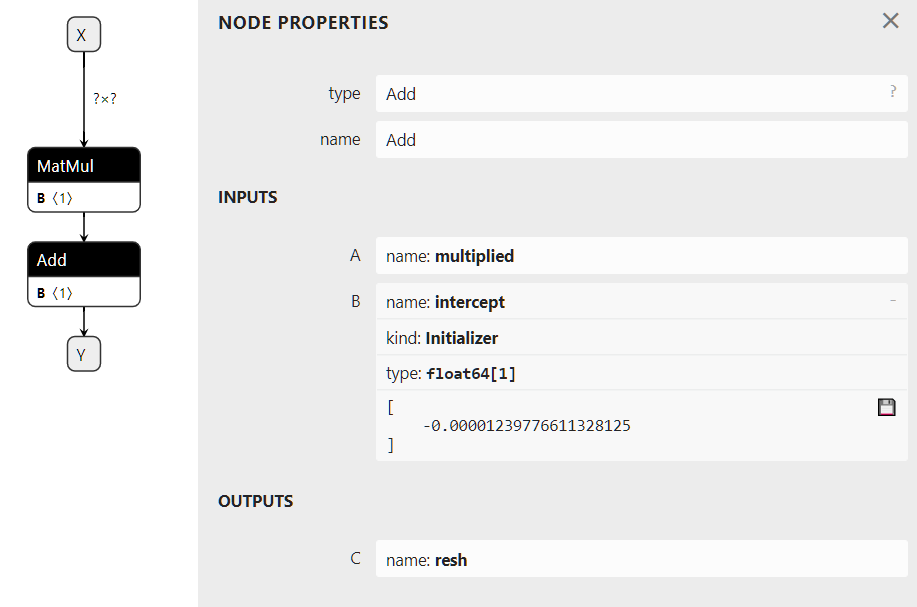

# ONNX 的概念

> ONNX Concepts

ONNX 类似于一种专门研究数学函数的编程语言。它定义了机器学习模型用这种语言实现其推理功能所需的所有必要算子。线性回归可以用以下方式表示:

> ONNX can be compared to a programming language specialized in mathematical functions. It defines all the necessary operations a machine learning model needs to implement its inference function with this language. A linear regression could be represented in the following way:

```python
def onnx_linear_regressor(X):
    "ONNX code for a linear regression"
    return onnx.Add(onnx.MatMul(X, coefficients), bias)
```

这个例子非常类似于开发人员用 Python 编写的表达式。它也可以表示为一个图，显示如何逐步变换特征以实现预测。这就是为什么用 ONNX 实现的机器学习模型经常被称为 ONNX 图。

> This example is very similar to an expression a developer could write in Python. It can be also represented as a graph that shows step-by-step how to transform the features to get a prediction. That’s why a machine-learning model implemented with ONNX is often referenced as an ONNX graph.


ONNX 旨在提供一种任何机器学习框架都可以用来描述其模型的通用语言。第一个场景是为了更容易在生产中部署机器学习模型。ONNX 解释器（或运行时）可以在部署它的环境中为这个任务专门实现和优化。使用 ONNX，可以构建一个独特的流程来在生产中部署模型，并且独立于用于构建模型的训练框架。onnx 实现了一个 python 运行时，可用于评估 ONNX 模型和 ONNX 算子。这是为了阐明 ONNX 的语义，并帮助理解和调试 ONNX 工具和转换器。它不用于生产，也不以优化性能为目标（参见 [onnx.reference](https://onnx.ai/onnx/api/reference.html#l-reference-implementation)）。

> ONNX aims at providing a common language any machine learning framework can use to describe its models. The first scenario is to make it easier to deploy a machine learning model in production. An ONNX interpreter (or runtime) can be specifically implemented and optimized for this task in the environment where it is deployed. With ONNX, it is possible to build a unique process to deploy a model in production and independent from the learning framework used to build the model. onnx implements a python runtime that can be used to evaluate ONNX models and to evaluate ONNX ops. This is intended to clarify the semantics of ONNX and to help understand and debug ONNX tools and converters. It is not intended to be used for production and performance is not a goal (see onnx.reference).

---

> - [输入、输出、节点、初始化器、属性](#输入输出节点初始化器属性)
> - [用 protobuf 序列化](#用-protobuf-序列化)
> - [元数据](#元数据)
> - [可用的算子和域的列表](#可用的算子和域的列表)
> - [支持的类型](#支持的类型)
> - [什么是 opset 版本？](#什么是-opset-版本)
> - [子图、测试和循环]()
> - [展开性]()
> - [函数]()
> - [形状（和类型）推断]()
> - [工具]()
>
> > - Input, Output, Node, Initializer, Attributes
> > - Serialization with protobuf
> > - Metadata
> > - List of available operators and domains
> > - Supported Types
> > - What is an opset version?
> > - Subgraphs, tests and loops
> > - Extensibility
> > - Functions
> > - Shape (and Type) Inference
> > - Tools

---

## 输入、输出、节点、初始化器、属性

> Input, Output, Node, Initializer, Attributes

构建 ONNX 图意味着用 ONNX 语言或者更准确地说是 ONNX 算子实现一个函数。线性回归可以这样写。以下几行不符合 python 语法。它只是说明模型的一种伪代码。

> Building an ONNX graph means implementing a function with the ONNX language or more precisely the ONNX Operators. A linear regression would be written this way. The following lines do not follow python syntax. It is just a kind of pseudo-code to illustrate the model.

```plaintext
Input: float[M,K] x, float[K,N] a, float[N] c
Output: float[M, N] y

r = onnx.MatMul(a, x)
y = onnx.Add(r, c)
```

这段代码实现了一个函数 *f(x，a，c) -> y = a @ x + c*。*x*、*a*、*c* 是**输入**，*y* 是**输出**。*r* 是一个中间结果。*MatMul* 和 *Add* 是**节点**。它们也有输入和输出。节点还有一个类型，即 [ONNX 算子库](https://onnx.ai/onnx/operators/index.html#l-onnx-operators)中的一个算子。这个图是用[一个简单的例子：线性回归]()一节中的示例构建的。

> This code implements a function f(x, a, c) -> y = a @ x + c. And x, a, c are the inputs, y is the output. r is an intermediate result. MatMul and Add are the nodes. They also have inputs and outputs. A node has also a type, one of the operators in ONNX Operators. This graph was built with the example in Section A simple example: a linear regression.

该图也可以有一个初始化器。当输入永远不变时——例如线性回归的系数——最有效的方法是将其转换为存储在图形中的常数。

> The graph could also have an initializer. When an input never changes such as the coefficients of the linear regression, it is most efficient to turn it into a constant stored in the graph.

```plaintext
Input: float[M,K] x
Initializer: float[K,N] a, float[N] c
Output: float[M, N] axc

ax = onnx.MatMul(a, x)
axc = onnx.Add(ax, c)
```

该图可以渲染成如下的图片。右边描述了 *Add* 算子，其第二个输入被定义为一个初始化器。这个图是用这段代码构建的：[初始化器，默认值](https://onnx.ai/onnx/intro/python.html#l-onnx-linear-regression-onnx-api-init)。

> Visually, this graph would look like the following image. The right side describes operator Add where the second input is defined as an initializer. This graph was obtained with this code Initializer, default value.



**属性**是算子的固定参数。算子 [Gemm](https://onnx.ai/onnx/operators/onnx__Gemm.html#l-onnx-doc-gemm) 有四个属性：*alpha*，*beta*，*transA*，*transB*。除非运行时通过其 API 允许，否则一旦加载了 ONNX 图，这些值就不能更改，并在所有预测中保持不变。

> An attribute is a fixed parameter of an operator. Operator Gemm has four attributes, alpha, beta, transA, transB. Unless the runtime allows it through its API, once it has loaded the ONNX graph, these values cannot be changed and remain frozen for all the predictions.

## 用 protobuf 序列化

> Serialization with protobuf

将机器学习模型部署到生产中通常需要重建用于训练该模型的整个环境，通常情况下使用 *docker*。一旦模型被转换成 ONNX，生产环境只需要一个运行时来执行用 ONNX 算子定义的图。这个运行时可以用任何适合生产应用的语言开发，C、java、python、javascript、C#、Webassembly、ARM…

> The deployment of a machine-learned model into production usually requires replicating the entire ecosystem used to train the model, most of the time with a docker. Once a model is converted into ONNX, the production environment only needs a runtime to execute the graph defined with ONNX operators. This runtime can be developed in any language suitable for the production application, C, java, python, javascript, C#, Webassembly, ARM…

但是要做到这一点，需要保存 ONNX 图。ONNX 使用 protobuf 将图形序列化到一个单独的块中（参见[解析和序列化](https://developers.google.com/protocol-buffers/docs/pythontutorial?hl=zh-cn#parsing-and-serialization)）。它旨在尽可能优化模型大小。

> But to make that happen, the ONNX graph needs to be saved. ONNX uses protobuf to serialize the graph into one single block (see Parsing and Serialization). It aims at optimizing the model size as much as possible.

## 元数据

> Metadata

机器学习模型会不断更新。跟踪模型版本、模型作者及其训练方式是很重要的。ONNX 提供了在模型本身中存储附加数据的可能性。

> Machine learned models are continuously refreshed. It is important to keep track of the model version, the author of the model and how it was trained. ONNX offers the possibility to store additional data in the model itself.

- **doc_string：该模型的人类可读文档。**

  可以使用 Markdown。
- **domain：表示模型名称空间或域的反向DNS名称，**

  例如，“org.onnx”
- **metadata_props：表示为字典 `map<string,string>` 的具名元数据，**

  （值、键）应该是无重复的。
- **model_author：逗号分隔的名称列表，**

  模型作者的个人姓名，和/或他们的组织。
- **model_license：开源许可证的众所周知的名称或 URL**

  在该许可下模型是可用的。
- **model_version：模型本身的版本，用整数编码。**
- **producer_name：用于生成模型的工具的名称。**
- **producer_version：生成工具的版本。**
- **training_info：一个可选的扩展，包含**

  训练信息（参见[TrainingInfoProto](https://onnx.ai/onnx/api/classes.html#l-traininginfoproto)）

> - doc_string: Human-readable documentation for this model.
>   Markdown is allowed.
> - domain: A reverse-DNS name to indicate the model namespace or domain,
>   for example, ‘org.onnx’
> - metadata_props: Named metadata as dictionary map<string,string>,
>   (values, keys) should be distinct.
> - model_author: A comma-separated list of names,
>   The personal name of the author(s) of the model, and/or their organizations.
> - model_license: The well-known name or URL of the license
>   under which the model is made available.
> - model_version: The version of the model itself, encoded in an integer.
> - producer_name: The name of the tool used to generate the model.
> - producer_version: The version of the generating tool.
> - training_info: An optional extension that contains
>   information for training (see TrainingInfoProto)

## 可用的算子和域的列表

> List of available operators and domains

主列表在这里描述：[ONNX 算子库](https://onnx.ai/onnx/operators/index.html#l-onnx-operators)。它包含标准矩阵算子（Add, Sub, MatMul, Transpose, Greater, IsNaN, Shape, Reshape…）、归约（ReduceSum、ReduceMin……）、图像变换（Conv、最大池化……）、深度神经网络层（RNN、DropOut……）、激活函数（Relu、soft max……）。它涵盖了实现标准和深度机器学习推理功能所需的大多数算子。ONNX 并不实现每个现有的机器学习算子，（因为）算子的列表将是无限的。

> The main list is described here: ONNX Operators. It merges standard matrix operators (Add, Sub, MatMul, Transpose, Greater, IsNaN, Shape, Reshape…), reductions (ReduceSum, ReduceMin, …) image transformations (Conv, MaxPool, …), deep neural networks layer (RNN, DropOut, …), activations functions (Relu, Softmax, …). It covers most of the operations needed to implement inference functions from standard and deep machine learning. ONNX does not implement every existing machine learning operator, the list of operator would be infinite.

主算子列表由域 **ai.onnx** 标识。一个**域**可以定义为一组算子。这个列表中的一些算子适用于文本，但是它们很难覆盖需求。主列表还缺少在标准机器学习中非常流行的基于树的模型。它们位于另一个域 **ai.onnx.ml**，这个域包含基于树的模型（TreeEnsemble Regressor，…），预处理（OneHotEncoder，LabelEncoder，…），SVM 模型（SVMRegressor，…），估算器（Imputr）。

> The main list of operators is identified with a domain ai.onnx. A domain can be defined as a set of operators. A few operators in this list are dedicated to text but they hardly cover the needs. The main list is also missing tree based models very popular in standard machine learning. These are part of another domain ai.onnx.ml, it includes tree bases models (TreeEnsemble Regressor, …), preprocessing (OneHotEncoder, LabelEncoder, …), SVM models (SVMRegressor, …), imputer (Imputer).

ONNX 只定义了这两个域。但是 onnx 库支持任何定制域和算子（参见[扩展性]()）。

> ONNX only defines these two domains. But the library onnx supports any custom domains and operators (see Extensibility).

## 支持的类型

> Supported Types

ONNX 规范为使用张量的数值计算进行了优化。张量是一种多维数组。它的定义如下。

> ONNX specifications are optimized for numerical computation with tensors. A tensor is a multidimensional array. It is defined by:

- 一个类型：元素的类型，张量中的所有元素都属于一样的类型
- 一个形状：一个包含所有维度的数组，这个数组可以是空的（empty），某个维度可以不定义（null）
- 一个连续的数组：它记录所有的值

> - a type: the element type, the same for all elements in the tensor
> - a shape: an array with all dimensions, this array can be empty, a dimension can be null
> - a contiguous array: it represents all the values

该定义不包括跨度或基于现有张量定义张量切片的可能性。ONNX 张量是一个稠密、填满的数组，没有跨度。

> This definition does not include strides or the possibility to define a view of a tensor based on an existing tensor. An ONNX tensor is a dense full array with no stride.

### 元素类型

> Element Type

ONNX 最初是为了辅助部署深度学习模型而开发的。这就是为什么规范最初是为浮点（32 位）设计的。目前的版本支持所有常见的类型。字典 [TENSOR_TYPE_MAP](https://onnx.ai/onnx/api/mapping.html#l-onnx-types-mapping) 给出了 *ONNX* 和 `numpy` 之间的对应关系。

> ONNX was initially developed to help deploying deep learning model. That’s why the specifications were initially designed for floats (32 bits). The current version supports all common types. Dictionary TENSOR_TYPE_MAP gives the correspondence between ONNX and numpy.

```python
import re
from onnx import TensorProto

reg = re.compile('^[0-9A-Z_]+$')

values = {}
for att in sorted(dir(TensorProto)):
    if att in {'DESCRIPTOR'}:
        continue
    if reg.match(att):
        values[getattr(TensorProto, att)] = att
for i, att in sorted(values.items()):
    si = str(i)
    if len(si) == 1:
        si = " " + si
    print("%s: onnx.TensorProto.%s" % (si, att))
```

```plaintext
 0: onnx.TensorProto.UNDEFINED
 1: onnx.TensorProto.FLOAT
 2: onnx.TensorProto.UINT8
 3: onnx.TensorProto.INT8
 4: onnx.TensorProto.UINT16
 5: onnx.TensorProto.INT16
 6: onnx.TensorProto.INT32
 7: onnx.TensorProto.INT64
 8: onnx.TensorProto.STRING
 9: onnx.TensorProto.BOOL
10: onnx.TensorProto.FLOAT16
11: onnx.TensorProto.DOUBLE
12: onnx.TensorProto.UINT32
13: onnx.TensorProto.UINT64
14: onnx.TensorProto.COMPLEX64
15: onnx.TensorProto.COMPLEX128
16: onnx.TensorProto.BFLOAT16
```

ONNX 是强类型的，其定义不支持隐式转换。即使其他语言支持，两个不同类型的张量或矩阵也不可能相加。这就是为什么必须在图中插入显式转换。

> ONNX is strongly typed and its definition does not support implicit cast. It is impossible to add two tensors or matrices with different types even if other languages does. That’s why an explicit cast must be inserted in a graph.

### 稀疏张量

> Sparse Tensor

稀疏张量适用于表示具有许多空系数的数组。ONNX 支持二维稀疏张量。[SparseTensorProto](https://onnx.ai/onnx/api/classes.html#l-onnx-sparsetensor-proto) 类定义了这些属性：*dims*、*indices*（int64）和 *values*。

> Sparse tensors are useful to represent arrays having many null coefficients. ONNX supports 2D sparse tensor. Class SparseTensorProto defines attributes dims, indices (int64) and values.

### 其他类型

> Other types

除张量和稀疏张量外，ONNX 还通过 [SequenceProto](https://onnx.ai/onnx/api/classes.html#l-onnx-sequence-proto) 和 [MapProto](https://onnx.ai/onnx/api/classes.html#l-onnx-map-proto) 类型支持张量序列、张量映射和张量映射序列。它们很少使用。

> In addition to tensors and sparse tensors, ONNX supports sequences of tensors, map of tensors, sequences of map of tensors through types SequenceProto, MapProto. They are rarely used.

## 什么是 opset 版本？

> What is an opset version?

opset 映射到 onnx 包的版本。每当小版本增加时，它就会递增。每个版本都会带来更新或新的算子。

> The opset is mapped to the version of the onnx package. It is incremented every time the minor version increases. Every version brings updated or new operators.

```python
import onnx
print(onnx.__version__, " opset=", onnx.defs.onnx_opset_version())
```

```python
1.14.0  opset= 19
```

每个 ONNX 图都附有一个 opset。它是一种全局信息。它定义了图中所有运算符的版本。操作符 Add 在版本 6、7、13 和 14 中进行了更新。如果图的 opset 是 15，这意味着算子 *Add* 遵循 14 版的规范。如果图的 opset 是 12，那么算子 *Add* 遵循规范的版本 7。图中的算子遵循其低于（或等于）全局图 opset 的最新定义。

> An opset is also attached to every ONNX graphs. It is a global information. It defines the version of all operators inside the graph. Operator Add was updated in version 6, 7, 13 and 14. If the graph opset is 15, it means operator Add follows specifications version 14. If the graph opset is 12, then operator Add follows specifications version 7. An operator in a graph follows its most recent definition below (or equal) the global graph opset.

一个图可能包括多个域的运算符，例如 *ai.onnx* 和 *ai.onnx.ml*。在这种情况下，图必须为每个域定义一个全局 opset。该规则适用于同一域内的每个运算符。

> A graph may include operators from several domains, ai.onnx and ai.onnx.ml for example. In that case, the graph must define a global opset for every domain. The rule is applied to every operators within the same domain.

## 子图、测试和循环

> Subgraphs, tests and loops

ONNX 实现了测试和循环。它们都以另一个 ONNX 图作为属性。这些结构通常很慢而且很复杂。如果可能的话，最好避免它们。

> ONNX implements tests and loops. They all take another ONNX graphs as an attribute. These structures are usually slow and complex. It is better to avoid them if possible.

### If

算子 [If](https://onnx.ai/onnx/operators/onnx__If.html#l-onnx-doc-if) 对条件求值并执行两个图中的一个。

> Operator If executes one of the two graphs depending on the condition evaluation.

```plaintextIf(condition) then
    execute this ONNX graph (`then_branch`)
else
    execute this ONNX graph (`else_branch`)
```
