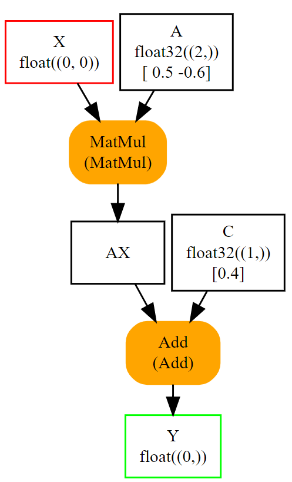

# Python 中的 ONNX

> ONNX with Python

接下来的章节强调了使用Python API onnx提供的主要功能来构建ONNX图。

> Next sections highlight the main functions used to build an ONNX graph with the Python API onnx offers.

- [一个简单的例子：线性回归](#一个简单的例子线性回归)
- [序列化](#序列化)
- [初始化器，默认值](#初始化器默认值)
- [属性](#属性)
- [Opset 和元数据](#opset-和元数据)
- [子图：测试和循环]()
- [函数]()
- [解析]()
- [检查器和形状推断]()
- [求值和运行时]()
- [实现细节]()

> - A simple example: a linear regression
> - Serialization
> - Initializer, default value
> - Attributes
> - Opset and metadata
> - Subgraph: test and loops
> - Functions
> - Parsing
> - Checker and Shape Inference
> - Evaluation and Runtime
> - Implementation details

## 一个简单的例子：线性回归

> A simple example: a linear regression

线性回归是机器学习中最简单的模型，由这个表达式描述：Y = XA + B。我们可以将其视为三个变量的函数 Y = f(X, A, B)，分解为 *y = Add(MatMul(X, A), B)*。这就是我们需要用 ONNX 算子来表示的内容。第一件事是用 ONNX 算子实现一个函数。ONNX 是强类型的。必须为函数的输入和输出定义形状和类型。也就是说，我们需要[建图函数](https://onnx.ai/onnx/api/helper.html#l-onnx-make-function)中四个函数来构建这个图：

> The linear regression is the most simple model in machine learning described by the following expression Y = XA + B. We can see it as a function of three variables Y = f(X, A, B) decomposed into y = Add(MatMul(X, A), B). That what’s we need to represent with ONNX operators. The first thing is to implement a function with ONNX operators. ONNX is strongly typed. Shape and type must be defined for both input and output of the function. That said, we need four functions to build the graph among the make function:

- *make_tensor_value_info*：声明一个变量（输入或输出），给出其形状和类型
- *make_node*：创建一个由运算（算子类型）、其输入和输出定义的节点
- *make_graph*：这个函数用前两个函数创建的对象创建一个 ONNX 图
- *make_model*：最后一个函数，用于合并图形和附加元数据

> - make_tensor_value_info: declares a variable (input or output) given its shape and type
> - make_node: creates a node defined by an operation (an operator type), its inputs and outputs
> - make_graph: a function to create an ONNX graph with the objects created by the two previous functions
> - make_model: a last function with merges the graph and additional metadata

在整个创建过程中，我们需要给图的每个输入和输出节点起名字。图的输入和输出是由 onnx 对象定义的，字符串用来指代中间结果。它看起来是这样的。

> All along the creation, we need to give a name to every input, output of every node of the graph. Input and output of the graph are defined by onnx objects, strings are used to refer to intermediate results. This is how it looks like.

```python
# imports

from onnx import TensorProto
from onnx.helper import (
    make_model, make_node, make_graph,
    make_tensor_value_info)
from onnx.checker import check_model

# inputs

# 'X' is the name, TensorProto.FLOAT the type, [None, None] the shape
X = make_tensor_value_info('X', TensorProto.FLOAT, [None, None])
A = make_tensor_value_info('A', TensorProto.FLOAT, [None, None])
B = make_tensor_value_info('B', TensorProto.FLOAT, [None, None])

# outputs, the shape is left undefined

Y = make_tensor_value_info('Y', TensorProto.FLOAT, [None])

# nodes

# It creates a node defined by the operator type MatMul,
# 'X', 'A' are the inputs of the node, 'XA' the output.
node1 = make_node('MatMul', ['X', 'A'], ['XA'])
node2 = make_node('Add', ['XA', 'B'], ['Y'])

# from nodes to graph
# the graph is built from the list of nodes, the list of inputs,
# the list of outputs and a name.

graph = make_graph([node1, node2],  # nodes
                    'lr',  # a name
                    [X, A, B],  # inputs
                    [Y])  # outputs

# onnx graph
# there is no metadata in this case.

onnx_model = make_model(graph)

# Let's check the model is consistent,
# this function is described in section
# Checker and Shape Inference.
check_model(onnx_model)

# the work is done, let's display it...
print(onnx_model)
```

```plaintext
ir_version: 8
graph {
  node {
    input: "X"
    input: "A"
    output: "XA"
    op_type: "MatMul"
  }
  node {
    input: "XA"
    input: "B"
    output: "Y"
    op_type: "Add"
  }
  name: "lr"
  input {
    name: "X"
    type {
      tensor_type {
        elem_type: 1
        shape {
          dim {
          }
          dim {
          }
        }
      }
    }
  }
  input {
    name: "A"
    type {
      tensor_type {
        elem_type: 1
        shape {
          dim {
          }
          dim {
          }
        }
      }
    }
  }
  input {
    name: "B"
    type {
      tensor_type {
        elem_type: 1
        shape {
          dim {
          }
          dim {
          }
        }
      }
    }
  }
  output {
    name: "Y"
    type {
      tensor_type {
        elem_type: 1
        shape {
          dim {
          }
        }
      }
    }
  }
}
opset_import {
  version: 19
}
```


一个空的形状（*None*）意味着任何形状，一个定义为 *[None, None]* 的形状表示这个对象是一个有两个维度的张量，没有任何进一步的精确信息。也可以通过查看图中每个对象的字段来检查 ONNX 图。

> An empty shape (None) means any shape, a shape defined as [None, None] tells this object is a tensor with two dimensions without any further precision. The ONNX graph can also be inspected by looking into the fields of each object of the graph.

```python
from onnx import TensorProto
from onnx.helper import (
    make_model, make_node, make_graph,
    make_tensor_value_info)
from onnx.checker import check_model

def shape2tuple(shape):
    return tuple(getattr(d, 'dim_value', 0) for d in shape.dim)

X = make_tensor_value_info('X', TensorProto.FLOAT, [None, None])
A = make_tensor_value_info('A', TensorProto.FLOAT, [None, None])
B = make_tensor_value_info('B', TensorProto.FLOAT, [None, None])
Y = make_tensor_value_info('Y', TensorProto.FLOAT, [None])
node1 = make_node('MatMul', ['X', 'A'], ['XA'])
node2 = make_node('Add', ['XA', 'B'], ['Y'])
graph = make_graph([node1, node2], 'lr', [X, A, B], [Y])
onnx_model = make_model(graph)
check_model(onnx_model)

# the list of inputs
print('** inputs **')
print(onnx_model.graph.input)

# in a more nicely format
print('** inputs **')
for obj in onnx_model.graph.input:
    print("name=%r dtype=%r shape=%r" % (
        obj.name, obj.type.tensor_type.elem_type,
        shape2tuple(obj.type.tensor_type.shape)))

# the list of outputs
print('** outputs **')
print(onnx_model.graph.output)

# in a more nicely format
print('** outputs **')
for obj in onnx_model.graph.output:
    print("name=%r dtype=%r shape=%r" % (
        obj.name, obj.type.tensor_type.elem_type,
        shape2tuple(obj.type.tensor_type.shape)))

# the list of nodes
print('** nodes **')
print(onnx_model.graph.node)

# in a more nicely format
print('** nodes **')
for node in onnx_model.graph.node:
    print("name=%r type=%r input=%r output=%r" % (
        node.name, node.op_type, node.input, node.output))
```

张量类型是一个整数（= 1）。下面的数组给出了与 numpy 类型的对应。

> The tensor type is an integer (= 1). The following array gives the equivalent type with numpy.

```python
import pprint
from onnx.mapping import TENSOR_TYPE_TO_NP_TYPE
```

```plaintext
pprint.pprint(TENSOR_TYPE_TO_NP_TYPE)
{1: dtype('float32'),
 2: dtype('uint8'),
 3: dtype('int8'),
 4: dtype('uint16'),
 5: dtype('int16'),
 6: dtype('int32'),
 7: dtype('int64'),
 8: dtype('O'),
 9: dtype('bool'),
 10: dtype('float16'),
 11: dtype('float64'),
 12: dtype('uint32'),
 13: dtype('uint64'),
 14: dtype('complex64'),
 15: dtype('complex128'),
 16: dtype('float32')}
```

## 序列化

> Serialization

ONNX 是建立在 protobuf 之上的。它为描述机器学习模型添加了必要的定义，在大多数情况下，ONNX 被用来对模型进行序列化或反序列化。第一节解决了这一需求。第二节介绍了数据的序列化和反序列化，如张量、稀疏张量...

> ONNX is built on the top of protobuf. It adds the necessary definitions to describe a machine learning model and most of the time, ONNX is used to serialize or deserialize a model. First section addresses this need. Second section introduces the serialization and deserialization of data such as tensors, sparse tensors…

### 模型序列化

> Model Serialization

模型需要被保存以进行部署。ONNX 是基于 protobuf 的。它最大限度地减少了在磁盘上保存图所需的空间。onnx 中的每个对象（见 [Protos](https://onnx.ai/onnx/api/classes.html#l-onnx-classes)）都可通过 *SerializeToString* 方法进行序列化。整个模型都是如此。

> The model needs to be saved to be deployed. ONNX is based on protobuf. It minimizes the space needed to save the graph on disk. Every object (see Protos) in onnx can be serialized with method SerializeToString. That’s the case for the whole model.

```python
from onnx import TensorProto
from onnx.helper import (
    make_model, make_node, make_graph,
    make_tensor_value_info)
from onnx.checker import check_model

def shape2tuple(shape):
    return tuple(getattr(d, 'dim_value', 0) for d in shape.dim)

X = make_tensor_value_info('X', TensorProto.FLOAT, [None, None])
A = make_tensor_value_info('A', TensorProto.FLOAT, [None, None])
B = make_tensor_value_info('B', TensorProto.FLOAT, [None, None])
Y = make_tensor_value_info('Y', TensorProto.FLOAT, [None])
node1 = make_node('MatMul', ['X', 'A'], ['XA'])
node2 = make_node('Add', ['XA', 'B'], ['Y'])
graph = make_graph([node1, node2], 'lr', [X, A, B], [Y])
onnx_model = make_model(graph)
check_model(onnx_model)

# The serialization
with open("linear_regression.onnx", "wb") as f:
    f.write(onnx_model.SerializeToString())

# display
print(onnx_model)
```

```plaintext
ir_version: 8
graph {
  node {
    input: "X"
    input: "A"
    output: "XA"
    op_type: "MatMul"
  }
  node {
    input: "XA"
    input: "B"
    output: "Y"
    op_type: "Add"
  }
  name: "lr"
  input {
    name: "X"
    type {
      tensor_type {
        elem_type: 1
        shape {
          dim {
          }
          dim {
          }
        }
      }
    }
  }
  input {
    name: "A"
    type {
      tensor_type {
        elem_type: 1
        shape {
          dim {
          }
          dim {
          }
        }
      }
    }
  }
  input {
    name: "B"
    type {
      tensor_type {
        elem_type: 1
        shape {
          dim {
          }
          dim {
          }
        }
      }
    }
  }
  output {
    name: "Y"
    type {
      tensor_type {
        elem_type: 1
        shape {
          dim {
          }
        }
      }
    }
  }
}
opset_import {
  version: 19
}
```

图可以通过 *load* 函数恢复：

> The graph can be restored with function load:

```python
from onnx import load

with open("linear_regression.onnx", "rb") as f:
    onnx_model = load(f)

# display

print(onnx_model)
```

```python
ir_version: 8
graph {
  node {
    input: "X"
    input: "A"
    output: "XA"
    op_type: "MatMul"
  }
  node {
    input: "XA"
    input: "B"
    output: "Y"
    op_type: "Add"
  }
  name: "lr"
  input {
    name: "X"
    type {
      tensor_type {
        elem_type: 1
        shape {
          dim {
          }
          dim {
          }
        }
      }
    }
  }
  input {
    name: "A"
    type {
      tensor_type {
        elem_type: 1
        shape {
          dim {
          }
          dim {
          }
        }
      }
    }
  }
  input {
    name: "B"
    type {
      tensor_type {
        elem_type: 1
        shape {
          dim {
          }
          dim {
          }
        }
      }
    }
  }
  output {
    name: "Y"
    type {
      tensor_type {
        elem_type: 1
        shape {
          dim {
          }
        }
      }
    }
  }
}
opset_import {
  version: 19
}
```

它看起来完全一样。任何模型都可以通过这种方式进行序列化，除非它们大于 2Gb。下一节将展示如何克服这个限制。

> It looks exactly the same. Any model can be serialized this way unless they are bigger than 2 Gb. protobuf is limited to size smaller than this threshold. Next sections will show how to overcome that limit.

### 数据序列化

> Data Serialization

张量的序列化通常这样完成：

> The serialization of tensor usually happens like the following:

```python
import numpy
from onnx.numpy_helper import from_array

numpy_tensor = numpy.array([0, 1, 4, 5, 3], dtype=numpy.float32)
print(type(numpy_tensor))

onnx_tensor = from_array(numpy_tensor)
print(type(onnx_tensor))

serialized_tensor = onnx_tensor.SerializeToString()
print(type(serialized_tensor))

with open("saved_tensor.pb", "wb") as f:
    f.write(serialized_tensor)
```

```plaintext
<class 'numpy.ndarray'>
<class 'onnx.onnx_ml_pb2.TensorProto'>
<class 'bytes'>
```

反序列化是这样：

> And the deserialization like:

```python
from onnx import TensorProto
from onnx.numpy_helper import to_array

with open("saved_tensor.pb", "rb") as f:
    serialized_tensor = f.read()
print(type(serialized_tensor))

onnx_tensor = TensorProto()
onnx_tensor.ParseFromString(serialized_tensor)
print(type(onnx_tensor))

numpy_tensor = to_array(onnx_tensor)
print(numpy_tensor)
```

```plaintext
<class 'bytes'>
<class 'onnx.onnx_ml_pb2.TensorProto'>
[0. 1. 4. 5. 3.]
```

同样的模式的适用范围不限于 [TensorProto](https://onnx.ai/onnx/api/classes.html#l-tensorproto)：

> The same schema can be used for but not limited to TensorProto:

```python
import onnx
import pprint
pprint.pprint([p for p in dir(onnx)
               if p.endswith('Proto') and p[0] != '_'])
```

```plaintext
['AttributeProto',
 'FunctionProto',
 'GraphProto',
 'MapProto',
 'ModelProto',
 'NodeProto',
 'OperatorProto',
 'OperatorSetIdProto',
 'OperatorSetProto',
 'OptionalProto',
 'SequenceProto',
 'SparseTensorProto',
 'StringStringEntryProto',
 'TensorProto',
 'TensorShapeProto',
 'TrainingInfoProto',
 'TypeProto',
 'ValueInfoProto']
```

这段代码可以用 *load_tensor_from_string* 函数简化（见 [Load a Proto](https://onnx.ai/onnx/api/serialization.html#l-onnx-load-data)）。

> This code can be simplified with function load_tensor_from_string (see Load a Proto).

```python
from onnx import load_tensor_from_string

with open("saved_tensor.pb", "rb") as f:
    serialized = f.read()
proto = load_tensor_from_string(serialized)
print(type(proto))
```

```plaintext
<class 'onnx.onnx_ml_pb2.TensorProto'>
```

## 初始化器，默认值

> Initializer, default value

以前的模型假设线性回归的系数也是模型的输入。这不是很方便。它们应该是模型本身的一部分，作为常量或**初始化器**，以遵循 onnx 语义。下一个例子修改了上一个例子，将输入 *A* 和 *B* 改为初始化器。这个包实现了两个函数，分别从 numpy 转换到 onnx 和反过来（见 [array](https://onnx.ai/onnx/api/numpy_helper.html#l-numpy-helper-onnx-array)）。

> The previous model assumed the coefficients of the linear regression were also input of the model. That’s not very convenient. They should be part of the model itself as constant or initializer to follow onnx semantic. Next example modifies the previous one to change inputs A and B into initializers. The package implements two functions to convert from numpy into onnx and the other way around (see array).

- `onnx.numpy_helper.to_array`: 从 onnx 转换到 numpy
- `onnx.numpy_helper.from_array`: 从 numpy 转换到 onnx

> - onnx.numpy_helper.to_array: converts from onnx to numpy
> - onnx.numpy_helper.from_array: converts from numpy to onnx

```python
import numpy
from onnx import numpy_helper, TensorProto
from onnx.helper import (
    make_model, make_node, make_graph,
    make_tensor_value_info)
from onnx.checker import check_model

# initializers
value = numpy.array([0.5, -0.6], dtype=numpy.float32)
A = numpy_helper.from_array(value, name='A')

value = numpy.array([0.4], dtype=numpy.float32)
C = numpy_helper.from_array(value, name='C')

# the part which does not change
X = make_tensor_value_info('X', TensorProto.FLOAT, [None, None])
Y = make_tensor_value_info('Y', TensorProto.FLOAT, [None])
node1 = make_node('MatMul', ['X', 'A'], ['AX'])
node2 = make_node('Add', ['AX', 'C'], ['Y'])
graph = make_graph([node1, node2], 'lr', [X], [Y], [A, C])
onnx_model = make_model(graph)
check_model(onnx_model)

print(onnx_model)
```

```plaintext
ir_version: 8
graph {
  node {
    input: "X"
    input: "A"
    output: "AX"
    op_type: "MatMul"
  }
  node {
    input: "AX"
    input: "C"
    output: "Y"
    op_type: "Add"
  }
  name: "lr"
  initializer {
    dims: 2
    data_type: 1
    name: "A"
    raw_data: "\000\000\000?\232\231\031\277"
  }
  initializer {
    dims: 1
    data_type: 1
    name: "C"
    raw_data: "\315\314\314>"
  }
  input {
    name: "X"
    type {
      tensor_type {
        elem_type: 1
        shape {
          dim {
          }
          dim {
          }
        }
      }
    }
  }
  output {
    name: "Y"
    type {
      tensor_type {
        elem_type: 1
        shape {
          dim {
          }
        }
      }
    }
  }
}
opset_import {
  version: 19
}
```



同样，可以通过浏览 onnx 结构来检查初始化器的样子。

> Again, it is possible to go through the onnx structure to check how the initializers look like.

```python
import numpy
from onnx import numpy_helper, TensorProto
from onnx.helper import (
    make_model, make_node, make_graph,
    make_tensor_value_info)
from onnx.checker import check_model

# initializers
value = numpy.array([0.5, -0.6], dtype=numpy.float32)
A = numpy_helper.from_array(value, name='A')

value = numpy.array([0.4], dtype=numpy.float32)
C = numpy_helper.from_array(value, name='C')

# the part which does not change
X = make_tensor_value_info('X', TensorProto.FLOAT, [None, None])
Y = make_tensor_value_info('Y', TensorProto.FLOAT, [None])
node1 = make_node('MatMul', ['X', 'A'], ['AX'])
node2 = make_node('Add', ['AX', 'C'], ['Y'])
graph = make_graph([node1, node2], 'lr', [X], [Y], [A, C])
onnx_model = make_model(graph)
check_model(onnx_model)

print('** initializer **')
for init in onnx_model.graph.initializer:
    print(init)
```

```plaintext
** initializer **
dims: 2
data_type: 1
name: "A"
raw_data: "\000\000\000?\232\231\031\277"

dims: 1
data_type: 1
name: "C"
raw_data: "\315\314\314>"
```

该类型也被定义为整数，其含义相同。在这第二个例子中，只剩下一个输入。输入 *A* 和 *B* 被移除。它们可以被保留。在这种情况下，它们是可选的：每一个与输入同名的初始化器都被认为是默认值。如果输入不存在，它就会取代输入。

> The type is defined as integer as well with the same meaning. In this second example, there is only one input left. Input A and B were removed. They could be kept. In that case, they are optional: every initiliazer sharing the same name as input is considered as a default value. It replaces the input if this one is not given.

## 属性

> Attributes

有些算子需要属性，比如 [Transpose](https://onnx.ai/onnx/operators/onnx__Transpose.html#l-onnx-doc-transpose) 算子。让我们为表达式 y = XA' + B 或y = Add(MatMul(X, Transpose(A)) + B) 构建图。Transpose 需要一个属性定义轴的互换：*perm=[1, 0]*。在 *make_node* 函数中，它被添加为一个具名属性。

> Some operators need attributes such as Transpose operator. Let’s build the graph for expression y = XA' + B or y = Add(MatMul(X, Transpose(A)) + B). Transpose needs an attribute defining the permutation of axes: perm=[1, 0]. It is added as a named attribute in function make_node.

```python
from onnx import TensorProto
from onnx.helper import (
    make_model, make_node, make_graph,
    make_tensor_value_info)
from onnx.checker import check_model

# unchanged
X = make_tensor_value_info('X', TensorProto.FLOAT, [None, None])
A = make_tensor_value_info('A', TensorProto.FLOAT, [None, None])
B = make_tensor_value_info('B', TensorProto.FLOAT, [None, None])
Y = make_tensor_value_info('Y', TensorProto.FLOAT, [None])

# added
node_transpose = make_node('Transpose', ['A'], ['tA'], perm=[1, 0])

# unchanged except A is replaced by tA
node1 = make_node('MatMul', ['X', 'tA'], ['XA'])
node2 = make_node('Add', ['XA', 'B'], ['Y'])

# node_transpose is added to the list
graph = make_graph([node_transpose, node1, node2],
                   'lr', [X, A, B], [Y])
onnx_model = make_model(graph)
check_model(onnx_model)

# the work is done, let's display it...
print(onnx_model)
```

```plaintext
ir_version: 8
graph {
  node {
    input: "A"
    output: "tA"
    op_type: "Transpose"
    attribute {
      name: "perm"
      ints: 1
      ints: 0
      type: INTS
    }
  }
  node {
    input: "X"
    input: "tA"
    output: "XA"
    op_type: "MatMul"
  }
  node {
    input: "XA"
    input: "B"
    output: "Y"
    op_type: "Add"
  }
  name: "lr"
  input {
    name: "X"
    type {
      tensor_type {
        elem_type: 1
        shape {
          dim {
          }
          dim {
          }
        }
      }
    }
  }
  input {
    name: "A"
    type {
      tensor_type {
        elem_type: 1
        shape {
          dim {
          }
          dim {
          }
        }
      }
    }
  }
  input {
    name: "B"
    type {
      tensor_type {
        elem_type: 1
        shape {
          dim {
          }
          dim {
          }
        }
      }
    }
  }
  output {
    name: "Y"
    type {
      tensor_type {
        elem_type: 1
        shape {
          dim {
          }
        }
      }
    }
  }
}
opset_import {
  version: 19
}
```


所有*建图*函数的列表如下。其中许多在[建图函数](https://onnx.ai/onnx/api/helper.html#l-onnx-make-function)一节中有所描述。

> The whole list of make functions is the following. Many of them are described in section make function.

```python
import onnx
import pprint
pprint.pprint([k for k in dir(onnx.helper)
               if k.startswith('make')])
```

```plaintext
['make_attribute',
 'make_attribute_ref',
 'make_empty_tensor_value_info',
 'make_function',
 'make_graph',
 'make_map',
 'make_model',
 'make_model_gen_version',
 'make_node',
 'make_operatorsetid',
 'make_opsetid',
 'make_optional',
 'make_optional_type_proto',
 'make_sequence',
 'make_sequence_type_proto',
 'make_sparse_tensor',
 'make_sparse_tensor_type_proto',
 'make_sparse_tensor_value_info',
 'make_tensor',
 'make_tensor_sequence_value_info',
 'make_tensor_type_proto',
 'make_tensor_value_info',
 'make_training_info',
 'make_value_info']
```

## Opset 和元数据

> Opset and metadata

加载之前创建的 ONNX 文件，检查它有什么样的元数据。

> Let’s load the ONNX file previously created and check what kind of metadata it has.
