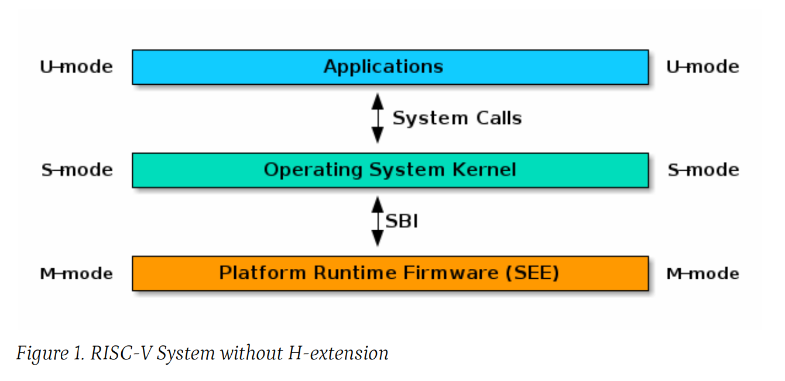
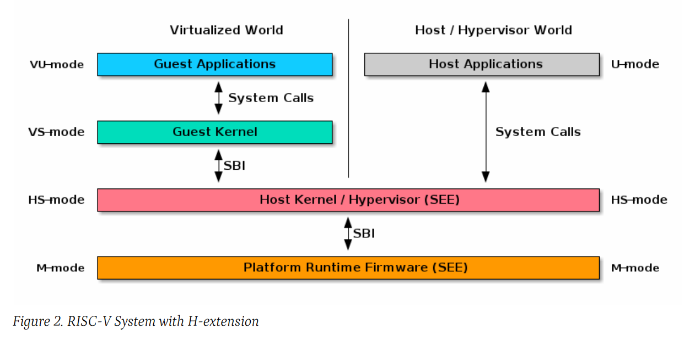

# 第一章 简介

> Chapter 1. Introduction

本规范描述了 RISC-V 特权级二进制接口，此处称为 SBI。通过定义平台（或监管级）特定功能的抽象，SBI 允许特权态（S 态或 VS 态）软件在所有 RISC-V 实现中可移植。SBI 的设计遵循 RISC-V 的一般理念，即拥有一个小核心以及一组可选的模块化扩展。

> This specification describes the RISC-V Supervisor Binary Interface, known from here on as SBI. The SBI allows supervisor-mode (S-mode or VS-mode) software to be portable across all RISC-V implementations by defining an abstraction for platform (or hypervisor) specific functionality. The design of the SBI follows the general RISC-V philosophy of having a small core along with a set of optional modular extensions.

SBI 扩展作为整体是可选的，但不应部分实现。如果 `sbi_probe_extension()` 发出扩展可用的信号，则 `sbi_get_spec_version()` 报告的 SBI 版本中存在的所有函数都必须符合该版本的 SBI 规范。

> SBI extensions as whole are optional but they shall not be partially implemented. If sbi_probe_extension() signals that an extension is available, all functions present in the SBI version reported by sbi_get_spec_version() must conform to that version of the SBI specification.

向特权态软件提供 SBI 接口的更高权限软件称为 SBI 实现或特权执行环境 (SEE: Supervisor Execution Environment)。SBI 实现（或 SEE）可以是在机器态（M 态）下执行的平台运行时固件（见下图 1），也可以是在监管态（HS 态）下执行的某个监管程序（见下图 2）。

> The higher privilege software providing SBI interface to the supervisor-mode software is referred as an SBI implementation or Supervisor Execution Environment (SEE). An SBI implementation (or SEE) can be platform runtime firmware executing in machine-mode (M-mode) (see below Figure 1) or it can be some hypervisor executing in hypervisor-mode (HS-mode) (see below Figure 2).

SBI 规范没有指定任何硬件发现方法。为此，特权软件必须依赖另外的行业标准硬件发现方法（即设备树或 ACPI）。

> The SBI specification doesn’t specify any method for hardware discovery. The supervisor software must rely on the other industry standard hardware discovery methods (i.e. Device Tree or ACPI) for that.
