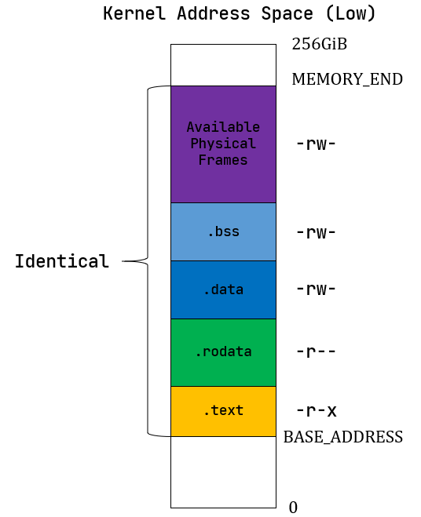

# `zCore` 与 `rCore(v3)` 内存布局的区别

[`rCore-Tutorial-v3` 第四章](https://rcore-os.github.io/rCore-Tutorial-Book-v3/chapter4/5kernel-app-spaces.html) 介绍了 `rCore` 内核地址空间的布局：

`rCore(v3)` 内核的四个全局逻辑段 `.text/.rodata/.data/.bss` 恒等映射到物理地址，其他部分也按确定的方式分布。这样做的好处有：

1. 结构清晰

   内核**常驻部分直接占用的物理地址空间**、**内核为支持用户进程额外需要的内核栈空间**和**供用户进程自由使用的物理页帧空间**在内核地址空间中的位置和大小都是固定的。

2. 虚拟空间可用范围大

   内核和每个用户进程都能使用除一个 4KiB 的跳板页以外完整的 `512GiB - 4KiB` Sv39 虚拟地址空间。内核恒等映射的物理地址在虚拟地址空间中也是复用的。

3. 启动平滑

   内核在启用虚拟内存前后访问全局逻辑段的方式不变。因此在 `init` 应用初始化之前的任何时候启动虚拟内存都是一样的。

4. 内核与用户进程全隔离

   内核空间在用户态看来完全不存在，因此即使硬件存在旁路漏洞也无法从用户态窥探内核内存布局。参考[`wikipedia`](https://zh.wikipedia.org/wiki/%E5%86%85%E6%A0%B8%E9%A1%B5%E8%A1%A8%E9%9A%94%E7%A6%BB)。

然而，隔离的内核页表也带来一个重大的缺点，就是每次陷入内核都需要切换整个页表，性能比较差。因此，`zCore` 采用不隔离的内核页表，即用户进程的页表中包含整个内核页表的映射，通过页表项上的标志位保护访问。这样陷入内核时自然可以访问内核的地址空间，不需要刷新页表，具有更好的性能。

`zCore` 在 riscv64 架构 + Sv39 方案下采取的具体措施是将内核的物理地址映射到偏移 0xffff_ffff_0000_0000 的虚拟地址，即把整个物理地址空间映射到 Sv39 的高 256GiB 空间。内核需要的空间本来就不大，这样设计不会导致什么问题。应用程序可以知道内核的内存布局，只靠页表标志位实现访问保护。
