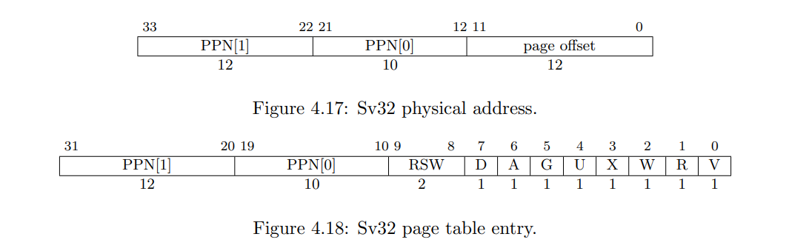

# 【翻译】RISCV 特权级规范-寻址及内存保护

> 原文 [RISCV 特权级规范 20211203](https://github.com/riscv/riscv-isa-manual/releases/download/Priv-v1.12/riscv-privileged-20211203.pdf) §4.3.1。最新版见[官网规范发布页](https://riscv.org/technical/specifications/)。
>
> 原文节标题：`Addressing and Memory Protection`。

## §4.3.1 寻址与内存保护

> Sv32 implementations support a 32-bit virtual address space, divided into 4 KiB pages. An Sv32 virtual address is partitioned into a virtual page number (VPN) and page offset, as shown in Figure 4.16. When Sv32 virtual memory mode is selected in the MODE field of the satp register, supervisor virtual addresses are translated into supervisor physical addresses via a two-level page table. The 20-bit VPN is translated into a 22-bit physical page number (PPN), while the 12- bit page offset is untranslated. The resulting supervisor-level physical addresses are then checked using any physical memory protection structures (Sections 3.7), before being directly converted to machine-level physical addresses. If necessary, supervisor-level physical addresses are zero-extended to the number of physical address bits found in the implementation.

Sv32 实现支持 32 位虚拟地址空间，每页 4KiB。Sv32 虚拟地址被划分为虚拟页号（VPN）和页内偏移量，如图 4.16 所示。在 `satp` 寄存器的 `MODE` 字段中选择 Sv32 虚拟内存模式时，特权级虚拟地址通过两级页表转换为特权级物理地址。20 位虚拟页号被转换为 22 位物理页码（PPN），12 位页内偏移量不变。如果生成的特权级物理地址能通过物理内存保护结构（§3.7）的检查，将直接转换为机器级物理地址。如有必要，特权级物理地址将零扩展为实现要求的物理地址位数。

> > For example, consider an RV32 system supporting 34 bits of physical address. When the value of satp.MODE is Sv32, a 34-bit physical address is produced directly, and therefore no zero-extension is needed. When the value of satp.MODE is Bare, the 32-bit virtual address is translated (unmodified) into a 32-bit physical address, and then that physical address is zero-extended into a 34-bit machine-level physical address.
>
> 以支持 34 位物理地址的 RV32 系统为例。当 `satp.MODE` 的值为 Sv32 时，直接产生一个 34 位的物理地址，因此不需要零扩展。当 `satp.MODE` 的值为 Bare 时，32 位虚拟地址被转换（未修改）为 32 位物理地址，然后该物理地址被零扩展为 34 位机器级物理地址。

> Sv32 page tables consist of 2^10^ page-table entries (PTEs), each of four bytes. A page table is exactly the size of a page and must always be aligned to a page boundary. The physical page number of the root page table is stored in the satp register.

Sv32 页表由 2^10^ 个页表项（PTE）组成，每项占 4 个字节。页表正好是页的大小，并且必须始终与页边界对齐。根页表的物理页号存储在 `satp` 寄存器中。

> The PTE format for Sv32 is shown in Figures 4.18. The V bit indicates whether the PTE is valid; if it is 0, all other bits in the PTE are don’t-cares and may be used freely by software. The permission bits, R, W, and X, indicate whether the page is readable, writable, and executable, respectively. When all three are zero, the PTE is a pointer to the next level of the page table; otherwise, it is a leaf PTE. Writable pages must also be marked readable; the contrary combinations are reserved for future use. Table 4.5 summarizes the encoding of the permission bits.

Sv32 的页表项格式如图 4.18 所示。`V` 位表示页表项是否有效；如果为 0，则页表项中的所有其他位都是无关的，并且可以被软件自由使用。权限位 `R`、`W` 和 `X` 分别指示页面是否可读、可写和可执行。当三个都为零时，页表项是指向下一级页表的指针；否则，它是一个叶子项。可写页面也必须标记为可读；相反的组合（只写）保留供将来使用。下表总结了权限位的编码。

| `X` | `W` | `R` | 含义
| :-: | :-: | :-: | :-
|  0  |  0  |  0  | 指向下一级页表的指针
|  0  |  0  |  1  | 只读页
|  0  |  1  |  0  | *留待未来使用*
|  0  |  1  |  1  | 可读写页
|  1  |  0  |  0  | 可执行页
|  1  |  0  |  1  | 可读可执行页
|  1  |  1  |  0  | *留待未来使用*
|  1  |  1  |  1  | 可读写可执行页

> Attempting to fetch an instruction from a page that does not have execute permissions raises a fetch page-fault exception. Attempting to execute a load or load-reserved instruction whose effective address lies within a page without read permissions raises a load page-fault exception. Attempting to execute a store, store-conditional, or AMO instruction whose effective address lies within a page without write permissions raises a store page-fault exception.

尝试获取指令时，如果所在页面没有执行权限，会引发获取页面错误异常。尝试执行加载或加载保留指令时，如果作用地址位于没有读取权限的页面内，会引发加载页面错误异常。尝试执行存储、条件存储或 `AMO` 指令时，如果作用地址位于没有写权限的页面内，会引发存储页面错误异常。

> > AMOs never raise load page-fault exceptions. Since any unreadable page is also unwritable, attempting to perform an AMO on an unreadable page always raises a store page-fault exception.
>
> `AMO` 绝不引发加载页面错误异常。由于任何不可读页面也是不可写的，因此尝试在不可读页面上执行 `AMO` 总是会引发存储页面错误异常。

> The U bit indicates whether the page is accessible to user mode. U-mode software may only access the page when U=1. If the SUM bit in the sstatus register is set, supervisor mode software may also access pages with U=1. However, supervisor code normally operates with the SUM bit clear, in which case, supervisor code will fault on accesses to user-mode pages. Irrespective of SUM, the supervisor may not execute code on pages with U=1.

`U` 位指示页面是否可被用户（user）态访问。用户态软件只能访问 `U=1` 的页面。如果设置了 `sstatus` 寄存器中的 `SUM` 位，特权软件也可以访问 `U=1` 的页面。然而，特权代码通常在 `SUM` 位清零的情况下运行，在这种情况下，管理员代码将在访问用户模式页面时出错。无论 `SUM` 是多少，特权态都不能在 `U=1` 的页面上执行代码。

> > An alternative PTE format would support different permissions for supervisor and user. We omitted this feature because it would be largely redundant with the SUM mechanism (see Section 4.1.1.2) and would require more encoding space in the PTE.
>
> 还有一种页表项格式支持特权态和用户态有不同的权限。我们省略了这个特性，因为它与 `SUM` 机制在很大程度上是重复的（参见 §4.1.1.2），并且在页表项中需要更多的编码空间。

> The G bit designates a global mapping. Global mappings are those that exist in all address spaces. For non-leaf PTEs, the global setting implies that all mappings in the subsequent levels of the page table are global. Note that failing to mark a global mapping as global merely reduces performance, whereas marking a non-global mapping as global is a software bug that, after switching to an address space with a different non-global mapping for that address range, can unpredictably result in either mapping being used.

`G` 位表示全局（global）映射。全局映射是存在于所有地址空间中的映射。对于非叶页表项，设置为全局意味着页表后续级别中的所有映射都是全局的。请注意，没有将全局映射标记为全局只是降低了性能，而将非全局映射标记为全局是一个软件错误，在切换到对该地址范围具有不同非全局映射的地址空间后，可能会在使用二者之一时导致不可预测的结果。

> > Global mappings need not be stored redundantly in address-translation caches for multiple ASIDs. Additionally, they need not be flushed from local address-translation caches when an SFENCE.VMA instruction is executed with rs2̸=x0.
>
> 全局映射不需要冗余地存储在多个 ASID 的地址转换缓存中。此外，当执行 `rs2̸=x0` 的 `SFENCE.VMA` 指令时，它们不需要从本地地址转换缓存中刷新。

> The RSW field is reserved for use by supervisor software; the implementation shall ignore this field.

`RSW` 字段保留供特权级软件使用；实现应忽略该字段。

> Each leaf PTE contains an accessed (A) and dirty (D) bit. The A bit indicates the virtual page has been read, written, or fetched from since the last time the A bit was cleared. The D bit indicates the virtual page has been written since the last time the D bit was cleared.

每个叶子页表项包含一个访问（`A` for access）和脏（`D` for dirty）位。`A` 位指示自上次清除 `A` 位以来该虚拟页面被读取、写入或取走过。`D` 位表示自上次清除 `D` 位以来，虚拟页被写过。

> Two schemes to manage the A and D bits are permitted:
>
> - When a virtual page is accessed and the A bit is clear, or is written and the D bit is clear, a page-fault exception is raised.
> - When a virtual page is accessed and the A bit is clear, or is written and the D bit is clear, the implementation sets the corresponding bit(s) in the PTE. The PTE update must be atomic with respect to other accesses to the PTE, and must atomically check that the PTE is valid and grants sufficient permissions. Updates of the A bit may be performed as a result of speculation, but updates to the D bit must be exact (i.e., not speculative), and observed in program order by the local hart. Furthermore, the PTE update must appear in the global memory order no later than the explicit memory access, or any subsequent explicit memory access to that virtual page by the local hart. The ordering on loads and stores provided by FENCE instructions and the acquire/release bits on atomic instructions also orders the PTE updates associated with those loads and stores as observed by remote harts. The PTE update is not required to be atomic with respect to the explicit memory access that caused the update, and the sequence is interruptible. However, the hart must not perform the explicit memory access before the PTE update is globally visible.

规范允许两种管理 `A` 位和 `D` 位的方案：

- 当访问一个 `A` 位清零的虚拟页面，或写入一个 `D` 位清零的虚拟页面时，引发一个页错误异常。

- 当访问一个 `A` 位清零的虚拟页面，或写入一个 `D` 位清零的虚拟页面时，将页表项中的这些位置 1。页表项更新对于页表项的其他访问必须是原子的，并且必须原子地检查页表项是否有效并授予足够的权限。`A` 位的更新可能是推测的结果，但 `D` 位的更新必须是准确的（即，不是推测的），并且按照程序顺序对本地硬件线程可见。此外，页表项更新必须在不迟于显式内存访问或本地硬件线程对该虚拟页面的任何后续显式内存访问之前出现在全局内存顺序中。由 `FENCE` 指令提供的加载和存储排序以及原子指令上的获取/释放位也对与远程硬件线程观察到的那些加载和存储相关的页表项更新进行排序。对于导致更新的显式内存访问，页表项更新不需要是原子的，并且序列是可中断的。但是，在页表项更新全局可见之前，硬件线程不得执行显式内存访问。

> All harts in a system must employ the same PTE-update scheme as each other.

系统中的所有硬件线程必须使用相同的页表项更新方案。

> > Prior versions of this specification required PTE A bit updates to be exact, but allowing the A bit to be updated as a result of speculation simplifies the implementation of address translation prefetchers. System software typically uses the A bit as a page replacement policy hint, but does not require exactness for functional correctness. On the other hand, D bit updates are still required to be exact and performed in program order, as the D bit affects the functional correctness of page eviction.
>
> 该规范的先前版本要求准确地更新页表项 `A` 位，但允许作为推测结果更新 `A` 位简化了地址转换预取器的实现。系统软件通常使用 `A` 位作为页面替换策略提示，但功能正确性不要求 `A` 位更新的准确性。另一方面，`D` 位更新仍然需要准确并按程序顺序执行，因为 `D` 位会影响页面换出的功能正确性。
>
> > Implementations are of course still permitted to perform both A and D bit updates only in an exact manner.
>
> 当然，仍然允许实现仅以精确的方式执行 `A` 和 `D` 位更新。
>
> > In both cases, requiring atomicity ensures that the PTE update will not be interrupted by other intervening writes to the page table, as such interruptions could lead to A/D bits being set on PTEs that have been reused for other purposes, on memory that has been reclaimed for other purposes, and so on. Simple implementations may instead generate page-fault exceptions.
>
> 对于这两种实现，要求原子性确保页表项更新不会被对页表的其他写入中断，因为这种中断可能会导致 `A`/`D` 位被设置在已经被重用于其他目的的页表项或已经被回收的内存等。简单的实现可能会产生页错误异常。
>
> > The A and D bits are never cleared by the implementation. If the supervisor software does not rely on accessed and/or dirty bits, e.g. if it does not swap memory pages to secondary storage or if the pages are being used to map I/O space, it should always set them to 1 in the PTE to improve performance.
>
> `A` 和 `D` 位绝不会被硬件清除。如果特权软件不依赖于访问位和/或脏位，例如，如果它不将主存页面交换到辅存，或者如果页面用于映射 I/O 空间，则应始终在页表项中将它们设置为 1 以提高性能。

> Any level of PTE may be a leaf PTE, so in addition to 4 KiB pages, Sv32 supports 4 MiB megapages. A megapage must be virtually and physically aligned to a 4 MiB boundary; a page-fault exception is raised if the physical address is insufficiently aligned.

任何级别的页表项都可能是叶子页表项，因此除了 4KiB 页面之外，Sv32 还支持 4MiB 的巨页。巨页必须在虚拟上和物理上与 4MiB 边界对齐；如果物理地址未充分对齐，则会引发页面错误异常。

> For non-leaf PTEs, the D, A, and U bits are reserved for future standard use. Until their use is defined by a standard extension, they must be cleared by software for forward compatibility.

对于非叶页表项，`D`、`A` 和 `U` 位被保留给未来的标准使用。标准扩展定义如何使用它们之前，它们必须被软件清零，以便向前兼容。

> For implementations with both page-based virtual memory and the “A” standard extension, the LR/SC reservation set must lie completely within a single base page (i.e., a naturally aligned 4 KiB region).

对于同时具有基于页面的虚拟内存和 `A` 标准扩展的实现，`LR/SC` 保留集必须完全位于单个基页内（即自然对齐的 4KiB 区域）。
