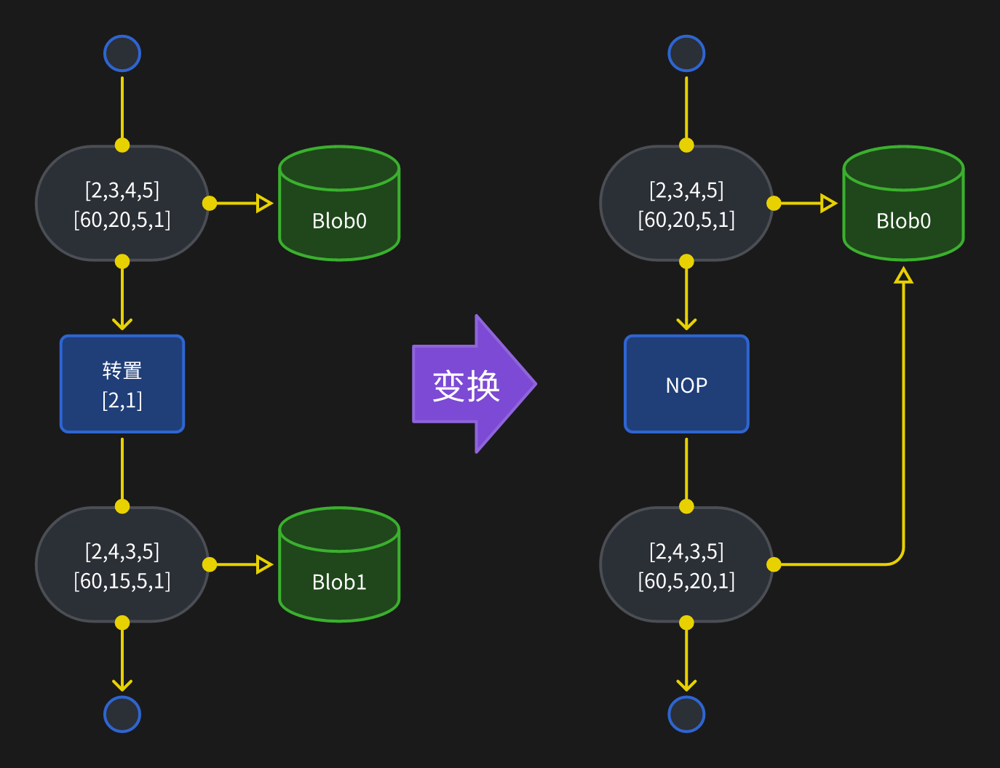
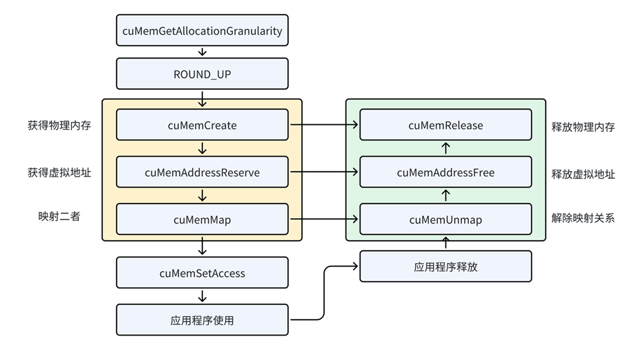
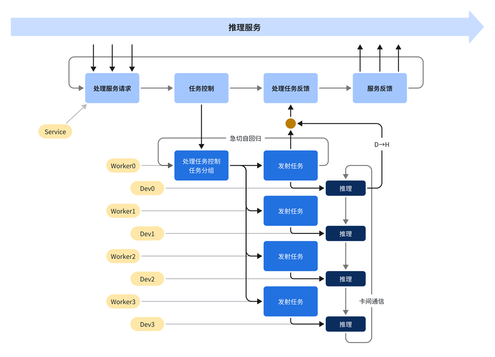

# InfiniLM 技术报告

大家好，今天由我来给大家介绍基于 Rust 的推理框架 InfiniLM。关于推理系统的通用知识在前几节课都介绍过了，本节课主要是基于这个实际可用系统的代码介绍一些具体的技术点。

## Rust 语言

由于本次训练营在之前的课程中大家可能都没怎么用到 Rust 语言，所以这里首先对 Rust 语言做个介绍。


如今 Rust 在网上热度相当之高，号称编程语言原神；但是相比传统的工业界使用的语言比如 C++、Java，渗透的领域又比较少。包括我在内很多 Rust 语言的拥护者经常被问到为什么要使用 Rust，Rust 和主流语言又有哪些差别？

| 维度         | Python                       | Java                           | C                            | C++                           | Rust                             |
| ------------ | ---------------------------- | ------------------------------ | ---------------------------- | ----------------------------- | -------------------------------- |
| **语法特点** | 动态类型，缩进控制作用域，GC | 静态类型，面向对象，GC         | 纯面向过程，指针操作，无 GC  | 支持面向对象，支持模板，无 GC | 所有权+借用检查，模式匹配，无 GC |
| **执行模式** | 虚拟机解释执行               | 编译到字节码然后虚拟机解释执行 | 编译到二进制                 | 编译到二进制                  | 编译到二进制                     |
| **应用领域** | AI/数据科学、Web、自动化脚本 | 企业后端、Android、大数据      | 操作系统、嵌入式、驱动开发   | 游戏引擎、高频交易、系统软件  | 互联网、系统软件                 |
| **构建工具** | pip + setuptools、Poetry     | Maven/Gradle/Ant               | Make、CMake、XMake ...       | Make、CMake、XMake ...        | Cargo（官方）                    |
| **库平台**   | PyPI（Python Package Index） | Maven Central                  | 无统一平台，多为源码分发     | 无统一平台，多为源码分发      | crates.io（官方，源码分发）      |

我这里列出了一个对比表格，大家可以看一下。总的来说，在语法和执行模式方面，Rust 和 C/C++ 一样，都是无 GC、无运行时、编译到二进制执行的语言，所以这三个语言可用于系统编程，互相之间交互也比较方便。而 Rust 和 C/C++ 在语法和构建上是有很多具体的差别的，这里就不详细展开讲 Rust 语法了，只补充一个小例子说明 Rust 和 C/C++ 在软件建模上的差别：

在多线程的并行编程中，锁是一种非常常用的抽象。以互斥锁为例，

C++ 的[互斥锁](https://zh.cppreference.com/w/cpp/thread/mutex)是这个样子：

```c++
std::mutex mutex; // 锁对象
{
    std::lock_guard<std::mutex> guard(mutex); // 控制上锁区域的 RAII 对象
    ...
}
```

Rust 的[互斥锁](https://doc.rust-lang.org/std/sync/struct.Mutex.html)是这个样子：

```rust
let data: Mutex<i32> = Mutex::new(0); // 锁对象，隐去了常与 Mutex 配合的 Arc
{
    let mut data = data.lock().unwrap(); // 控制上锁区域的 RAII 对象
    ...
}
```

抛去语法上的差异，这两份代码其实是相当接近的。但是这两份代码也展示了 C++ 和 Rust 在对互斥锁的理解上根本性的不同，即：C++ 的 `std::mutex` 锁住的是时序；Rust 的 `Mutex` 锁住的是对象。

直观理解这两种抽象的差别，我们可以补全要使用互斥锁保护的对象：

```c++
std::mutex mutex;
int counter = 0;
{
    // 程序员需要保证：锁 mutex 真的保护了 counter 吗？
    std::lock_guard<std::mutex> guard(mutex);
    counter += 42;
}
```

```rust
let counter: Mutex<i32> = Mutex::new(0);
{
    // 锁和数据被捆成单个变量 counter
    let mut num = counter.lock().unwrap();
    *num += 42; // 不锁定，编译器不让你碰 num
}
```

通过这个例子希望大家对于 Rust 的安全性建立一个直观的印象。就像这个例子一样，Rust 利用语法层面的生命周期和借用检查，巧妙地通过抽象将许多原本只能在运行期测试的错误纳入了编译期可检查的范围。除此之外，Rust 由于有官方的构建工具和库分发平台，查找和使用第三方库的难度相比 C/C++ 来说低很多。

## InfiniLM 的结构

现在正式进入对 InfiniLM 项目的介绍。InfiniLM 作为一个实际应用的系统，具有多个逻辑组件，能完成的功能也比较复杂。

目前 InfiniLM 的仓库有 3 个主要的分支：

1. version1
2. main
3. llama.cu

这 3 个分支的代码架构都非常不同，我们今天会基于最新的 llama.cu 这个分支介绍最新的功能和结构。llama.cu 这个分支目前支持且仅支持在英伟达显卡和 cuda 兼容的国产硬件上推理。可以生成文本、对话、还可以打开 OpenAI 兼容的 web API。对话的功能相对来说好操作，也比较有代表性。只需要用这个命令就可以启动了：

```shell
cargo chat `model`
```

### InfiniLM 的逻辑组件

llama.cu 这个分支里面，InfiniLM 可以大致分为 4 个逻辑组件，分别是：

1. 模型构建工具：使用预定义的的神经网络结构递归搭建模型结构；
2. 图表示和图优化：将 NN 搭建的模型结构转化为计算图，并变换和优化计算图；
3. 运行时和调度器：加载变换后的计算图，调度计算逻辑；
4. 应用程序：处理参数、用户请求，跟引擎核心交互；

其中模型结构、图表示和硬件无关的预定义优化在一个独立的项目 InfiniNN 中，运行时和调度器在 InfiniLM 的 llama.cu crate 里，应用程序在 xtask crate 里。我会从这些组件里面挑出一些比较有特色的技术点给大家介绍。

## 技术点

### 1. 模型构建

在模型构建的部分，为了在具有结构共性的大模型之间复用结构的定义，InfiniNN 采取的是类似 PyTorch 的神经网络组件的抽象。InfiniNN 中预定义了很多常用的结构组件。结构组件需要实现一个 `NuralNetwork` 特质。

```rust
trait NuralNetwork<T>: Sized {
    fn launch(
        self,
        inputs: impl IntoIterator<Item = Tensor<T>>,
        ctx: Context<T>,
    ) -> Result<(Context<T>, Vec<Tensor<T>>), NNError>;
}
```

这个特质实际上定义了这个神经网络的传播过程，所以它的参数是神经网络本身、输入的张量和一个用于与环境交互的上下文结构，返回操作过的上下文以及输出的张量。在传播过程中，神经网络会将张量传递给子网络或者通过算子来改变张量的元信息和数据。

例如，线性层是这样定义的：

> 示例中为了保持代码的简单性，去除了可见性等语法结构。

```rust
struct Linear<T> {
    dt: DigitLayout,   // 线性层权重的数据类型
    shape: [usize; 2], // 线性层的核心操作是矩阵乘，这是权重矩阵的形状
    weight: T,         // 权重矩阵
    bias: Option<(DigitLayout, T)>, // 线性层偏置，可能有
    allow_residual: bool, // 线性层可以融合残差连接
}

impl<T> NuralNetwork<T> for Linear<T> {
    fn launch(
        self,
        inputs: impl IntoIterator<Item = Tensor<T>>,
        mut ctx: Context<T>,
    ) -> Result<(Context<T>, Vec<Tensor<T>>), NNError> {
        let Self {
            dt,
            shape,
            weight,
            bias,
            allow_residual,
        } = self;
        let [r, c] = shape;

        // 从外部加载权重矩阵
        let w = ctx.load_external("weight", dt, [r.into(), c.into()], weight);

        let mut inputs = inputs.into_iter();

        // 提取第一个输入张量
        let x = inputs.next().unwrap();
        let outputs = match inputs.next() {
            // 融合残差连接的情况
            Some(residual) if allow_residual => match bias {
                Some((dt, bias)) => {
                    // 有偏置，从外部加载偏置矩阵
                    let b = ctx.load_external("bias", dt, [r.into()], bias);
                    // 调用线性算子
                    ctx.call("", "linear", Some(true.into()), [x, residual, w, b])
                }
                None => {
                    // 调用线性算子
                    ctx.call("", "linear", Some(true.into()), [x, residual, w])
                }
            },
            // 不融合残差连接的情况
            _ => match bias {
                Some((dt, bias)) => {
                    // 有偏置，从外部加载偏置矩阵
                    let b = ctx.load_external("bias", dt, [r.into()], bias);
                    // 调用线性算子
                    ctx.call("", "linear", Some(false.into()), [x, w, b])
                }
                None => {
                    // 调用线性算子
                    ctx.call("", "linear", Some(false.into()), [x, w])
                }
            },
        };

        Ok((ctx, outputs?))
    }
}
```

看一个比较复杂的例子，自注意力层是这样的：

```rust
// 自注意力层是由 qkvo 4 个线性层和注意力运算组成的
// 其中 qkv 线性层可以融合，这个融合需要改变权重存储方式，所以必须离线进行
// 在线性层和注意力计算之间可以插入归一化和旋转位置编码
struct Attention<T> {
    nh: usize,
    nkvh: usize,
    qkv: Linear<T>,
    q_norm: Option<Normalization<T>>,
    k_norm: Option<Normalization<T>>,
    rope: Option<RoPE<T>>,
    output: Linear<T>,
}

// 旋转位置编码有自己的参数和权重
struct RoPE<T> {
    multimodal: bool,
    nctx: usize,
    sin: T,
    cos: T,
}

impl<T> NuralNetwork<T> for Attention<T> {
    fn launch(
        self,
        inputs: impl IntoIterator<Item = Tensor<T>>,
        mut ctx: Context<T>,
    ) -> Result<(Context<T>, Vec<Tensor<T>>), NNError> {
        destruct!([x, pos, residual] = inputs);

        let Self {
            nh,
            nkvh,
            qkv,
            q_norm,
            k_norm,
            rope,
            output,
        } = self;
        // 陷入 qkv 线性层，“自”注意力体现在 qkv 的融合
        destruct!([x] = ctx.trap("attn-qkv", qkv, [x])?);
        dims!([_, dqkv] = x);
        let dh = dqkv.clone() / (nh + nkvh + nkvh);

        // 调用 split 算子分开 qkv 输出，这是算子调用的简单写法，跟 `ctx.call` 功能等价
        destruct!([q, k, v] = x.split("split-qkv", 1, [nh.into(), nkvh.into(), nkvh.into()])?);

        // 如果 q 需要归一化
        let q = match q_norm {
            Some(norm) => {
                let q = q.tile("", 1, [nh.into(), dh.clone()])?;
                destruct!([q] = ctx.trap("attn-q-norm", norm, [q])?);
                q.merge("", 1, 2)?
            }
            None => q,
        };
        // 如果 k 需要归一化
        let k = match k_norm {
            Some(norm) => {
                let k = k.tile("", 1, [nkvh.into(), dh.clone()])?;
                destruct!([k] = ctx.trap("attn-k-norm", norm, [k])?);
                k.merge("", 1, 2)?
            }
            None => k,
        };
        // 如果 qk 需要旋转位置编码
        let [q, k] = match rope {
            Some(RoPE {
                multimodal,
                nctx,
                sin,
                cos,
            }) => {
                let shape = [nctx.into(), dh.clone() / 2];
                let sin = ctx.load_external("rope.sin", types::F32, shape.clone(), sin);
                let cos = ctx.load_external("rope.cos", types::F32, shape, cos);

                let op = if multimodal { "mrope" } else { "rope" };
                destruct!(
                    [q_] = ctx.call(
                        "attn-q-rope",
                        op,
                        None,
                        [q, pos.clone(), sin.clone(), cos.clone()]
                    )?
                );
                destruct!([k_] = ctx.call("attn-k-rope", op, None, [k, pos, sin, cos])?);
                [q_, k_]
            }
            None => [q, k],
        };

        // 执行注意力计算
        destruct!([o] = ctx.call("", "attention", Some(dh.into()), [q, k, v,])?);
        // 陷入 output 线性层
        let outputs = ctx.trap("attn-output", output, [o, residual]);

        Ok((ctx, outputs?))
    }
}
```

可以看到，在自注意力结构中复用了线性层和归一化层的定义。这种递归的定义方式减少了重复代码。

### 2. 稠密的计算图表示

有了递归搭建的神经网络结构之后，只需要执行一遍神经网络的 `launch` 方法就可以把神经网络执行中用到的张量和算子都记录下来，生成一张计算图。

这里 InfiniLM 用到一种跟 InfiniTensor 很不一样的计算图表示方法。在 InfiniTensor 以及其他一些 AI 编译器中，计算图是使用大量指针组织起来的一个在存储上十分稀疏的结构。这是 InfiniTensor 中张量定义的片段，可以看到张量会关联产生和消费自己的算子：

```c++
protected:
    int dim;
    DataType dtype;
    vector<WRef<OperatorObj>> targets;
    WRef<OperatorObj> source;
    Blob data;

private:
    Shape shape;
```

这是算子定义的片段，可以看到算子也会关联自己的输入输出张量、还有自己的前驱后继算子。

```c++
protected:
    OpType type;
    TensorVec inputs;
    TensorVec outputs;
    vector<WRef<OperatorObj>> predecessors;
    vector<WRef<OperatorObj>> successors;
```

对于一个完整的计算图，可能涉及到数百个算子、数千个张量，这些对象会随着构图和图变换，悬浮在整个地址空间上任意的位置，相当于是一个图的链表。访问尤其是遍历这样的数据结构会有极大的性能损失。另外，在图优化的不同阶段需要不同的节点和边，这种图结构也不方便剥离节点和边的具体定义。为了简化多层的图结构定义，优化遍历性能，InfiniLM 中采用了一种特殊的稠密图数据结构。代码是这样的：

```rust
/// 图拓扑
struct GraphTopo {
    /// 全图输入边数量
    n_inputs: usize,
    /// 全图输出边数量
    n_outputs: usize,
    /// 连接关系序号表
    connections: Box<[usize]>,
    /// 节点信息表
    nodes: Box<[TopoNode]>,
}

/// 拓扑节点
struct TopoNode {
    /// 新增局部边数量
    n_local: usize,
    /// 输入边数量
    n_inputs: usize,
    /// 输出边数量
    n_outputs: usize,
}
```

这种数据结构用序号和数量描述图的拓扑连接关系，与节点和边的具体类型无关。因此存储高度压缩，具有很好的访问和遍历性能。

具体来说，`GraphTopo` 结构体的 4 个字段分别是图的全局输入边数量、全局输出边数量、连接关系序号和节点信息。节点信息中保存的是节点的输入边数量、输出边数量和所谓**新增局部边**数量，**局部边**可以理解为常量，即不是由节点生成、也不是全图输入边，但被这个节点消费的边。所有的权重都属于局部边。

这些数字为什么就能表示图的连接关系呢？实际上这些数据在逻辑上可以映射到一个节点表和一个边表。节点表就是 `GraphTopo` 结构体中的节点：

| 节点序号 | 局部边 | 输入边 | 输出边 |
| :------: | :----: | :----: | :----: |
| 0        | l0     | i0     | o0     |
| 1        | l1     | i1     | o1     |
| ...      | ...    | ...    | ...    |
| n        | ln     | in     | on     |

但是我们实际希望的是连接关系，也就不能是数量，而应该是一系列序号。但是每个节点的输入输出数量是不同的，也不好设置一个最大值，如果要直接在节点上存储序号的话就不得不使用 `Vec` 之类的变长容器，这会导致拓扑存储进一步碎片化。因此这里对数据结构做了一个转化。`GraphTopo` 结构体中并没有直接存储一个边表。这个边表实际上是由节点表隐式映射出来的。我们根据边的所有权关系，从节点表信息中虚拟出边的顺序和序号。因为每个边只能有 0 个或 1 个源节点，因此我们让边挂载在产生它或者第一次使用它的节点名下，也就能构造这样一个边表：

```plaintext
| n_inputs 个全局输入边 | l0 个新增局部边 | o0 个普通的边 | l1 个新增局部边 | o1 个普通的边 | ...
|   所有权属于全图的边  |      所有权属于每个节点的边     |
```

有个这个边表，就实现了对每个边的唯一定位。在边序号的基础之上可以定义节点的输入边，也就是 `GraphTopo` 结构体中的 `connections` 字段：

```plaintext
| n_outputs 个全局输出边 |     i0 个边的序号    | i1 个边的序号 | ...
| 作为全图输出的边序号表 | 每个节点的入边序号表 |
```

经过映射之后，节点表上的数量转化为节点表和连接表上的区间，遍历区间可获得序号：

| 节点序号 | 局部边           | 输入边            | 输出边           |
| :------: | :--------------: | :---------------: | :--------------: |
| 0        | 节点表里的 l0 项 | 连接表里的 i0 项  | 节点表里的 o0 项 |
| 1        | 节点表里的 l1 项 | 连接表里的 i1 项  | 节点表里的 o1 项 |
| ...      | ...              | ...               | ...              |
| n        | 节点表里的 ln 项 | 连接表里的 in 项  | 节点表里的 on 项 |

在拓扑的基础之上，再补充两个简单的数组结构，就可以把序号映射到具体信息：

```rust
struct Graph<N, E> {
    topo: GraphTopo,
    nodes: Box<[N]>,
    edges: Box<[E]>,
}
```

这种拓扑和信息严格解耦的数据结构，可以很方便地在不修改拓扑的情况下替换节点和边的类型。这种特性非常有利于多级图表示。

### 3. 元信息变换和存储区生命周期分析

接下来介绍 InfiniLM 里做的一个比较有特色的图优化方法。

在 AI 编译器的课程中介绍过，张量的关键信息包括数据类型、形状和存储布局，一些张量变换可以表示为对存储布局的变换，而不需要实际操作数据。在神经网络构建的过程中，张量因为没有实际加载，也就不存在存储布局，这些张量变换和针对数据的计算一样，会视作一个算子标注到计算图上。存储布局信息是在图变换过程中补充到图上的。

在图变换的一个阶段，会为所有张量生成存储布局信息。最初，认为所有张量都是连续、稠密、行优先或者说大端的存储布局。也就是说，在形状中越靠后的维度越连续，例如：

| 维度序号 | 0  | 1  | 2 | 3 |
| :------: |:--:|:--:|:-:|:-:|
| 形状     | 2  | 3  | 4 | 5 |
| 步长     | 60 | 20 | 5 | 1 |

接下来，搜索图中所有可以转换为张量变换的算子（节点），改变其输出张量的布局，标记其复用输入张量的存储区域，最后将算子标记为空。



这样的变换可以多次发生，连续的元信息变换会全部变为空。做完变换之后，会出现多个张量指向同一个存储空间的情况，因此存储空间的生命周期不再与张量绑定。根据张量被读写的顺序，可以确定存储空间的生命周期，即从第一次被张量引用开始，到最后一次被张量引用为止。根据存储空间的生命周期可以按节点顺序给存储空间做预分配，分配方式应该在 AI 编译器课程中介绍过，此处不再重复。

### 4. GGuf 模型文件

在运行时部分，有几个比较有意思的东西可以介绍。

首先，不同于 HuggingFace 定义的 config.json/model.bin/model.safetensors，InfiniLM 从 GGuf 格式加载模型。
HuggingFace 的经典方式将模型存储在多个文件中，且把模型配置信息写在人类可读写的 json 文件中，这导致模型的定义方式非常混乱。每个模型都有自己的一套配置方式，难以复用；多个文件的版本管理也比较繁琐。

GGuf 格式是 llama.cpp 项目定义的一种二进制存储格式。如图所示，GGuf 格式是一种 All In One 的架构，将模型的所有信息都存储在单个文件中，管理起来十分简单。并且其元信息是以二进制形式存储，可以直接通过 memory mapping 映射到内存，整段拷贝和解析，读取性能相对于大量使用文本的 json 格式更高。


在 InfiniLM 决定采用 GGuf 格式时，Rust 社区还没有好用的 GGuf 操作库，因此我们自己开发了一个并发布到了 crates.io 平台。使用我们开发的 [ggus](https://crates.io/crates/ggus) 库加载 GGuf 文件非常容易，而且性能极高：

```rust
let file = File::open(file_path)?;       // 打开文件
let data = unsafe { Mmap::map(&file) }?; // 映射文件
let gguf = GGuf::new(&data)?;            // 解析 GGuf
```

### 5. 异步模型加载

从磁盘读取模型到主存之后，下一步是将模型加载到显存。如果直接使用同步的 cuda malloc + cuda memcpy，拷贝整个模型是很耗时的。尤其是分布式推理需求中，由于需要分布式推理的情况下，显存可能不足以放下整个模型，还需要在主存上使用 CPU 对模型参数预处理之后再拷贝到卡：

1. 在文件中定位参数张量；
2. 从磁盘加载（memory mapping 可能触发缺页中断导致延迟）；
3. 在主存预处理（分布式切分等）；
4. 同步拷贝到卡；
5. 定位下一个张量，循环；

但是这个全同步的流程显然极大浪费了机器上的资源，等待卡拷贝时 CPU 闲置，等待 CPU 处理时卡总线闲置。必须让 CPU 和显卡异步操作才能尽量用上两份资源。

CUDA（以及所有国产硬件）提供了异步拷贝的 API。但是这个 API 实际异步，需要 Host 存储区域是**锁页**的。通常来说，主存是由操作系统控制的虚地址空间，当用户进程访问未映射的虚地址时，触发 mmu 的缺页中断，操作系统接管并分配物理页给进程。但是当异步操作时，要拷贝的主存区域访问权限会交给显卡，此时没有机会触发缺页中断，如果真的发生异步只会导致访问异常。操作系统提供了专门的锁页内存接口来解决这个问题，即分配主存时可以要求操作系统立即映射物理页，不得触发缺页中断。CUDA Driver API 要求只有发生在锁页内存和显存之间的拷贝才能真正异步进行。

因此，拷贝流程会变得复杂：

1. 在文件中定位参数张量；
2. 从磁盘加载（memory mapping 可能触发缺页中断导致延迟）；
3. 分配锁页内存；
4. 在主存预处理（分布式切分等），并将处理结果放置在锁页内存；
5. 触发异步拷贝到卡；
6. 等待拷贝完成，回收锁页内存；
7. 定位下一个张量，循环（和 6 异步并发执行）；

另外一个实际情况是，分配锁页内存由于必然需要陷入内核，实际分配物理页（涉及物理页擦洗等一系列步骤），这个操作本身极慢，甚至可能达到数百毫秒，因此锁页内存也不能随意分配和回收，必须尽量复用。幸好由于几乎所有深度神经网络都是一系列相同类型和规模的层堆叠成的，内部含有大量大小相同的参数，只需要使用一个简单的 Slab 分配器就可以实现无碎片复用锁页内存。核心代码如下（移除了所有标签和修饰符）：

```rust
struct WeightLoader<'ctx> {
    /// 锁页内存的 slab 分配器
    slab: Slab<usize, HostMem<'ctx>>,
    /// 异步加载任务队列
    queue: VecDeque<(Event<'ctx>, HostMem<'ctx>)>,
    /// 使用 slab 分配器的黑名单
    /// slab 分配器的原理导致分配出来的空间会持续存在，不会自动释放
    /// 不常用规模的空间没必要使用分配器
    no_reuse: BTreeSet<usize>,
}

impl<'ctx> WeightLoader<'ctx> {
     fn load(
        &mut self,
        dst: &mut [DevByte],
        stream: &Stream<'ctx>,
        f: impl FnOnce(&mut [u8]),
    ) -> usize {
        // 此次加载的任务规模
        let size = size_of_val(dst);
        // 从 slab 分配器调用
        let mut host = self
            .slab
            .take(&size)
            .unwrap_or_else(|| stream.ctx().malloc_host::<u8>(size));
        // host -> locked -> device
        f(&mut host);
        stream.memcpy_h2d(dst, &host);

        if self.no_reuse.contains(&size) {
            // 不使用分配器，同步等待
            stream.synchronize();
        } else {
            // 使用分配器，先入队再出队
            self.queue.push_back((stream.record(), host))
        }
        self.free_complete()
    }

    fn free_complete(&mut self) -> usize {
        let mut ans = 0;
        while let Some((event, host)) = self.queue.pop_front() {
            if event.is_complete() {
                ans += host.len();
                self.slab.put(host.len(), host)
            } else {
                self.queue.push_front((event, host));
                break;
            }
        }
        ans
    }
}

struct Slab<K, V>(HashMap<K, Vec<V>>);

impl<K: Eq + Hash, V> Slab<K, V> {
    fn take<Q>(&mut self, key: &Q) -> Option<V>
    where
        K: Borrow<Q>,
        Q: ?Sized + Hash + Eq,
    {
        self.0.get_mut(key).and_then(|pool| pool.pop())
    }

    fn put(&mut self, key: K, value: V) {
        self.0.entry(key).or_default().push(value);
    }
}
```

### 6. 虚存管理

在介绍 GGuf 模型文件和参数异步加载时，我们都提到了主存虚存。虚存是现代 CPU 和操作系统的核心机制，极大简化了进程存储空间的管理，创造了巨大的优化空间。显然这么方便的机制，显卡也应该有。实际上，英伟达和几乎所有国产硬件都已经内置了虚存映射的控制硬件，并允许用户通过 API 控制卡上虚存。

> [CUDA Driver API 文档/虚存管理](https://docs.nvidia.com/cuda/cuda-driver-api/group__CUDA__VA.html#group__CUDA__VA)

这是英伟达博客中提供的一个虚存管理 API 调用顺序示意图：



虚存适用于这样的场景：

- 存储空间总体上不足；
- 实际使用的存储空间容量是动态的且难以预期；
- 需要访问时地址连续；

基于 Transfomer 架构的自回归式的生成类大模型恰好有一个场景具有这样的特性：KV Cache 管理。

首先，现在新的大语言模型通常都支持极大的上下文长度，在多数服务场景中，我们也希望单个机器能对多个用户请求进行批处理生成，因此存储空间必定总体不足；其次，在一个会话开始时，我们不知道它将会生成多少 token，因此 KV Cache 将占用的空间是动态且不可预期的；最后，KV Cache 作为两个独立张量参与 Transformer 计算（矩阵乘），正常情况下需要地址连续。

看代码：

```rust
struct VirMem {
    /// 虚地址
    ptr: CUdeviceptr,
    /// 虚地址区域长度
    len: usize,
    /// 物理页映射表：offset -> phy
    map: BTreeMap<usize, PhyRegion>,
}

enum PhyRegion {
    /// 映射的物理页
    Mapped(Arc<PhyMem>),
    /// 空闲的物理页
    Vacant(usize),
}

impl VirMem {
    /// 分配虚地址
    fn new(len: usize, min_addr: usize) -> Self {
        let mut ptr = 0;
        driver!(cuMemAddressReserve(&mut ptr, len, 0, min_addr as _, 0));
        Self {
            ptr,
            len,
            map: [(0, len.into())].into(),
        }
    }
}

impl Drop for VirMem {
    /// 释放虚地址
    fn drop(&mut self) {
        let Self { ptr, len, map } = self;
        let map = std::mem::take(map);
        /// 所有已经映射的物理页解除映射
        for (offset, region) in map {
            if let PhyRegion::Mapped(phy) = region {
                driver!(cuMemUnmap(*ptr + offset as CUdeviceptr, phy.len))
            }
        }
        driver!(cuMemAddressFree(*ptr, *len))
    }
}

/// 物理页
struct PhyMem {
    /// 物理页位置
    /// CUDA 支持统一内存编址，主存和所有卡的显存共享同一个地址空间，不会重叠
    /// 分配物理页时可选物理页在主存或某张卡
    /// 不同位置的物理页都可以映射到同一个虚地址空间
    location: CUmemLocation,
    /// 物理页句柄
    handle: CUmemGenericAllocationHandle,
    /// 物理页长度
    len: usize,
}

impl VirMem {
    fn map(&mut self, offset: usize, phy: Arc<PhyMem>) -> &mut [DevByte] {
        // 查找所在区间
        let (head, region) = self.map.range(..=offset).next_back().unwrap();
        // 获取空闲段长度
        let len = match *region {
            PhyRegion::Mapped(_) => panic!("mem is mapped"),
            PhyRegion::Vacant(len) => len,
        };
        assert!(phy.len <= len);
        // 映射
        {
            let ptr = self.ptr + offset as CUdeviceptr;
            driver!(cuMemMap(ptr, phy.len, 0, phy.handle, 0));
            let desc = CUmemAccessDesc {
                location: phy.location,
                flags: CUmemAccess_flags::CU_MEM_ACCESS_FLAGS_PROT_READWRITE,
            };
            driver!(cuMemSetAccess(ptr, phy.len, &desc, 1));
        }
        // 移除空闲段
        let head = *head;
        self.map.remove(&head);
        // 插入映射段
        let phy_len = phy.len;
        self.map.insert(offset, phy.into());
        // 插入头尾空闲段
        let head_len = offset - head;
        let tail_len = len - head_len - phy_len;
        if head_len > 0 {
            self.map.insert(head, head_len.into());
        }
        if tail_len > 0 {
            let tail = head + head_len + phy_len;
            self.map.insert(tail, tail_len.into());
        }
        unsafe { std::slice::from_raw_parts_mut((self.ptr + offset as CUdeviceptr) as _, phy_len) }
    }

    fn unmap(&mut self, offset: usize) -> Arc<PhyMem> {
        let region = self.map.get_mut(&offset).expect("offset is not a boundary");
        let len = match region {
            PhyRegion::Mapped(phy_mem) => phy_mem.len,
            PhyRegion::Vacant(_) => panic!("offset is not mapped"),
        };
        let PhyRegion::Mapped(phy) = std::mem::replace(region, len.into()) else {
            unreachable!()
        };
        let ptr = self.ptr + offset as CUdeviceptr;
        driver!(cuMemUnmap(ptr, phy.len));
        phy
    }
}
```

### 7. 异步调度

在之前的课程中大家应该已经学习到，大语言模型在核心的推理流程以外还有很多服务工作，包括确定每个会话是否要继续推理之类的。这些工作由于涉及到复杂的逻辑，需要跟操作系统的多个服务交互，基本上是需要在主机上进行的。但是如果每轮推理之后都需要等待主机做一系列操作才能开始下一轮推理，加速卡就会出现空闲的情况，在异步计算系统中，我们把这些空闲称作任务之间的气泡（Bubble）。

这个问题实际上跟之前异步加载一样，核心就是要避免主机和协处理器之间的同步。让异步的计算能够真正异步进行，这个工作就称作“调度”。InfiniLM 的异步任务调度系统如图所示：



从上到下，调度逻辑在主机上大致分为 3 个层级：

1. 用户响应层

   这一层的工作是与用户请求交互。用户请求通常从管道（pipeline，进程间通信）或套接字（socket，网络协议栈）到来，取决于应用程序的功能。用户请求的到来取决于用户的操作，因此必然是并发的、随机的。

2. 推理服务层

   用户的请求是并发随机到来的，但是推理的计算任务是以轮为单位循环进行的，并且每轮的时长相当长（几毫秒至上百毫秒），因此必须有一层将并发的请求组织起来变为顺序的。

3. 硬件控制层

   用户请求被组织成顺序的之后就可以发射到硬件进行计算。InfiniLM 支持单机多卡的分布式推理，用户输入需要被拷贝到卡上，然后主机向卡发射计算任务。为了避免主机发射形成瓶颈，InfiniLM 采取每卡一线程的控制模式并行发射任务。其中在分布式通信组中 rank=0 的卡同时负责完成非分布式的部分计算，包括将顺序的请求划分成批次（包括处理 trunked prefill 分块）、采样等工作。

在硬件控制层，就存在之前讲到的同步问题。由于自回归模型生成是否完结是由输出内容决定的，通常来说见到 `<eos>` token 表示输出完结。然而调度和分批的工作实在 rank=0 号卡的主机控制线程上进行的，正常来说，主机控制线程必须等待卡上计算完成，并将生成的 token 同步拷贝到主机才能进行判断。为了避免这些同步，InfiniLM 调度系统采用了一个特殊的结构，称作“急切自回归”。在一轮推理全部计算任务都发射到卡后，控制线程不等待计算完结，默认所有会话都不完结，直接根据当时情况进行下一轮推理的分批处理，甚至可以直接开始发射下一轮推理的计算任务，如此可以保证卡上任务不停机。

对自回归生成 token 的判断则被迁移到另一个流、另一个线程上进行。采样完成后，计算流上会直接拷贝一个输出的副本，原本直接传输到下一轮的输入，副本被传递到推理服务的线程上，这个线程的栈上留存这一个拷贝输出专用的流，在这个流上同步拷贝到主存，由推理服务线程判断是否出现 eos，发现 eos、或接收到用户发送的停止输出命令，再由推理服务层传回硬件控制层。接收到停止推理的命令，硬件服务层的下一轮推理就不再调度这些会话，并将 kv cache 异步传回推理服务层。这样就避免了自回归中必要的同步。
