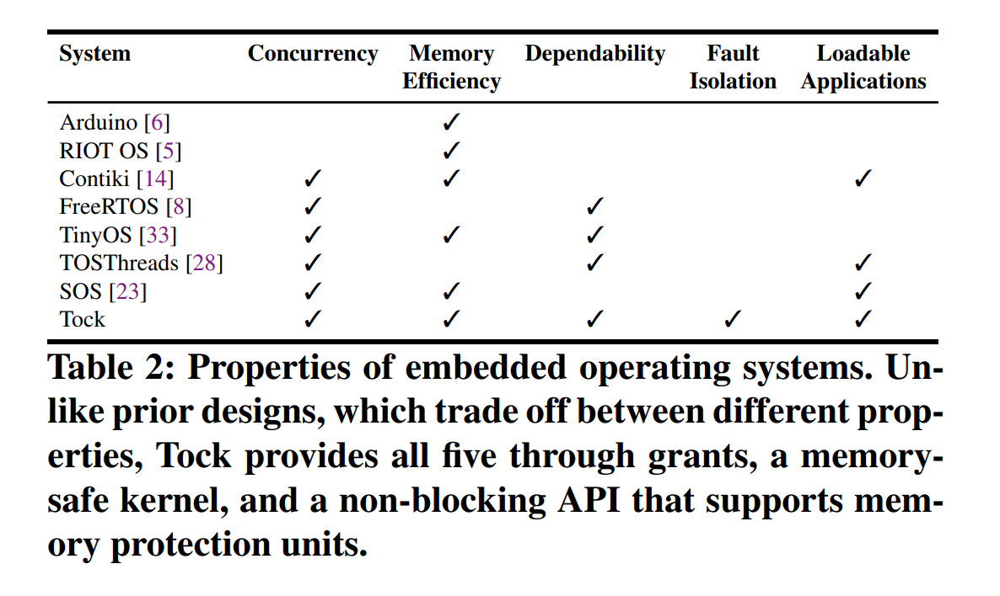

# Rust RTOS 调研

## 目录

- rust rtos
  - [tock](#tock-os)
  - [drone](#drone-os)
  - [embassy](#embassy)
- [杂项](#杂项)

## Tock OS

- [page](https://www.tockos.org/)

有特权级切换，用 PMP 隔离真正的进程，进程可以抢占调度。

## Drone OS

- [page](https://www.drone-os.com/)

### 设计原则

- 面向能效设计。鼓励中断驱动的执行模型；
- 硬实时。依赖原子操作而非临界区；
- 具有严格优先级的完全抢占式多任务。优先级较高的任务以最小的延迟优先执行；
- 高并发性。Drone 中的多任务是非常轻量的，而且 Rust 确保它也是安全的；
- 消息传递并发性。Drone 有开箱即用的同步原语；
- 默认为单栈。Drone 的并发原语本质上是无栈状态机。但也支持有栈的任务；
- 支持动态内存。Drone 允许你使用方便的数据结构，如可变长字符串或向量，同时仍然保持确定性和效率。
- libos，不支持动态应用程序加载；
- 不支持时间片；

## Embassy

- [page](https://embassy.dev/)

定位为库。

## 杂项

- [嵌入式厂商是嵌入式开发的敌人](https://www.zhihu.com/question/364774045/answer/2664157303)
- [visionfive：手册都没有](https://github.com/starfive-tech/JH7100_Docs/issues/5)
- [RTOS 大全](https://zhuanlan.zhihu.com/p/483751376)
- [RISCV 处理器大全](https://www.zhihu.com/question/285086198)
- [Redox](https://www.redox-os.org/zh/)
